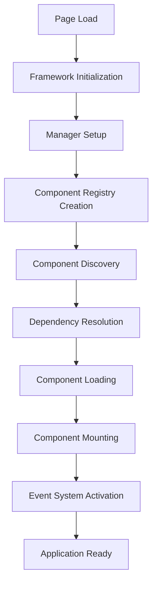

# Application Lifecycle

This document explains the complete application lifecycle from initial page load through component initialization, state management, and cleanup.

## Overview

The Parallelogram-JS application lifecycle follows a predictable pattern:



## Phase 1: Framework Initialization

### Step 1: Core System Setup

```javascript
// File: src/demo/demo.js
async function initFramework() {
  // 1. Initialize logger first for debugging throughout
  const logger = new DevLogger({ level: 'debug', prefix: 'Demo' }, true);
  logger.info('Initializing Enhancement Framework Demo');

  // 2. Create component registry
  const registry = ComponentRegistry.create('production');
}
```

**What happens:**

- DevLogger is instantiated for debugging and development feedback
- ComponentRegistry is created with environment-specific settings
- Global error handling is established

### Step 2: Manager Initialization

```javascript
// 3. Initialize core managers
const eventBus = new EventManager();
const router = new RouterManager({
  eventBus,
  logger,
  enableHistory: true,
  basePath: '/',
});

// 4. Initialize page manager
const pageManager = new PageManager({
  eventBus,
  router,
  logger,
  pages: {
    home: DemoHome,
    media: DemoMedia,
    performance: DemoPerformance,
    'ui-components': DemoUIComponents,
  },
});
```

**What happens:**

- EventManager creates the global event bus for component communication
- RouterManager sets up client-side routing with history API
- PageManager registers page classes for SPA navigation
- All managers receive dependency injection of shared services

## Phase 2: Component Registry Setup

### Step 3: Component Registration

```javascript
const componentRegistry = registry
  // Critical components (loaded first)
  .component('lazysrc', '[data-lazysrc]:not([data-lazysrc-complete])', {
    priority: 'critical',
    loader: createComponentLoader(Lazysrc),
  })

  // Normal priority with dependencies
  .component('carousel', '[data-carousel]', {
    priority: 'normal',
    dependsOn: ['lazysrc'],
    loader: createComponentLoader(Carousel),
  })

  // Low priority components
  .component('performance', '.performance-metrics', {
    priority: 'low',
    loader: createComponentLoader(PerformanceMonitor),
  });
```

**What happens:**

- Components are registered with selectors and priority levels
- Dependencies between components are declared
- Loader functions are associated with each component
- Registry builds dependency graph for proper loading order

### Step 4: Registry Configuration

```javascript
// Configure the registry with global dependencies
componentRegistry.configure({
  eventBus,
  logger,
  router,
});
```

**What happens:**

- Global services are injected into the registry
- All components will receive these dependencies when instantiated
- Registry is prepared for component loading

## Phase 3: Component Discovery and Loading

### Step 5: DOM Scanning

```javascript
// Registry scans DOM for component selectors
const foundComponents = componentRegistry.scan(document);

logger.info(`Found ${foundComponents.length} components to initialize`);
```

**What happens:**

- Registry queries DOM for all registered component selectors
- Elements are matched against component configurations
- Component loading queue is built based on priority and dependencies

### Step 6: Dependency Resolution

```javascript
// Internal registry process
const loadOrder = componentRegistry._resolveDependencies();
```

**What happens:**

- Dependency graph is resolved into loading order
- Critical components are queued first
- Dependencies are loaded before dependent components
- Circular dependencies are detected and handled

### Step 7: Component Loading

```javascript
// For each component in dependency order
for (const componentConfig of loadOrder) {
  // Load component module
  const ComponentClass = await componentConfig.loader();

  // Create component instance with injected dependencies
  const component = new ComponentClass.default({
    eventBus: this.eventBus,
    logger: this.logger,
    router: this.router,
  });

  // Store component instance
  this.components.set(componentConfig.name, component);
}
```

**What happens:**

- Component modules are dynamically imported
- Component classes are instantiated with dependency injection
- Components are stored in registry for lifecycle management

## Phase 4: Component Mounting

### Step 8: Element Processing

```javascript
// For each discovered element
elements.forEach(element => {
  const componentName = getComponentName(element);
  const component = this.components.get(componentName);

  // Mount component to element
  component.mount(element);
});
```

### Step 9: Component Initialization

Within each component's mount process:

```javascript
// BaseComponent.mount()
mount(element) {
    // Check if already mounted
    if (this.elements.has(element)) return this.update(element);

    // Initialize component state
    const state = this._init(element);

    // Store state using WeakMap
    this.elements.set(element, state);
}
```

**What happens:**

- Component's `_init()` method is called
- Component-specific state is created and stored
- Event listeners are attached using AbortController
- Component becomes active and ready for interaction

### Step 10: State Storage

```javascript
// Example component initialization
_init(element) {
    const state = {
        isActive: false,
        config: this._parseDataAttributes(element),
        controller: new AbortController(),
        elements: {
            trigger: element.querySelector('[data-trigger]'),
            content: element.querySelector('[data-content]')
        },
        cleanup: () => {
            // Component-specific cleanup logic
        }
    };

    // Set up event listeners with cleanup
    this._setupEventListeners(element, state);

    return state;
}
```

**What happens:**

- Component state is created with configuration data
- DOM references are cached for performance
- AbortController is created for clean event listener removal
- Cleanup function is defined for unmounting

## Phase 5: Event System Activation

### Step 11: Event Bus Connection

```javascript
// Components connect to global event bus
this.eventBus.on('route:changed', this._handleRouteChange.bind(this));
this.eventBus.on('user:action', this._handleUserAction.bind(this));
```

### Step 12: DOM Event Binding

```javascript
// Set up DOM event listeners with AbortController
element.addEventListener('click', this._handleClick.bind(this), {
  signal: state.controller.signal,
});

element.addEventListener('focusin', this._handleFocus.bind(this), {
  signal: state.controller.signal,
});
```

**What happens:**

- Components subscribe to relevant global events
- DOM event listeners are attached with automatic cleanup
- Event handling chains are established
- Component communication channels are active

## Understanding AbortController and Signals

### What is `state.controller.signal`?

The `signal` property comes from the **AbortController API**, a browser-native feature that provides a clean way to cancel event listeners and asynchronous operations. This is fundamental to preventing memory leaks in the framework.

### How It Works

```javascript
// 1. Create an AbortController in component state
const controller = new AbortController();

// 2. Get the signal from the controller
const signal = controller.signal;

// 3. Pass signal to event listeners
element.addEventListener('click', handler, { signal });
element.addEventListener('scroll', handler, { signal });
window.addEventListener('resize', handler, { signal });

// 4. Later, abort removes ALL listeners automatically
controller.abort();
```

### Signal Use Cases in Components

#### Context 1: Event Listeners (Primary Use)

```javascript
_init(element) {
  const state = {
    controller: new AbortController(),
  };

  // Multiple listeners, all managed by one controller
  element.addEventListener('click', this.handleClick, {
    signal: state.controller.signal
  });

  element.addEventListener('input', this.handleInput, {
    signal: state.controller.signal
  });

  document.addEventListener('keydown', this.handleKeydown, {
    signal: state.controller.signal
  });

  return state;
}

// All listeners removed with one call
unmount(element) {
  const state = this.elements.get(element);
  state.controller.abort(); // Cleanup complete!
}
```

#### Context 2: Fetch Requests

```javascript
async loadData(element) {
  const state = this.getState(element);

  try {
    const response = await fetch('/api/data', {
      signal: state.controller.signal
    });

    const data = await response.json();
    this.updateUI(data);
  } catch (error) {
    // AbortError thrown if component unmounts during fetch
    if (error.name === 'AbortError') {
      console.log('Request cancelled - component unmounted');
    }
  }
}
```

#### Context 3: Timers and Intervals

```javascript
_init(element) {
  const state = {
    controller: new AbortController(),
  };

  // Set up auto-refresh timer
  const intervalId = setInterval(() => {
    this.refresh(element);
  }, 5000);

  // Clean up timer when signal aborts
  state.controller.signal.addEventListener('abort', () => {
    clearInterval(intervalId);
  });

  return state;
}
```

#### Context 4: Mutation Observers

```javascript
_init(element) {
  const state = {
    controller: new AbortController(),
  };

  // Watch for DOM changes
  const observer = new MutationObserver(mutations => {
    this.handleMutations(mutations);
  });

  observer.observe(element, { childList: true });

  // Disconnect observer on cleanup
  state.controller.signal.addEventListener('abort', () => {
    observer.disconnect();
  });

  return state;
}
```

#### Context 5: Intersection Observers

```javascript
_init(element) {
  const state = {
    controller: new AbortController(),
  };

  const observer = new IntersectionObserver(entries => {
    entries.forEach(entry => {
      if (entry.isIntersecting) {
        this.loadContent(element);
      }
    });
  });

  observer.observe(element);

  state.controller.signal.addEventListener('abort', () => {
    observer.disconnect();
  });

  return state;
}
```

### Benefits of Using AbortController

1. **No Memory Leaks** - All event listeners are automatically removed when components unmount
2. **Single Cleanup Point** - One `abort()` call handles all cleanup
3. **Browser Native** - No custom cleanup logic needed
4. **Prevents Errors** - Stops callbacks from running after component removal
5. **Standards Compliant** - Uses modern web platform APIs

### Common Pattern in Components

```javascript
class MyComponent extends BaseComponent {
  _init(element) {
    // Create state with AbortController
    const state = {
      controller: new AbortController(),
      config: this._getDataAttr(element, 'config'),
      isActive: false,
    };

    // Use signal for all event listeners
    this.setupEventListeners(element, state.controller.signal);

    return state;
  }

  setupEventListeners(element, signal) {
    // All listeners use the same signal
    element.addEventListener('click', () => {
      this.handleClick(element);
    }, { signal });

    document.addEventListener('scroll', () => {
      this.handleScroll(element);
    }, { signal });

    window.addEventListener('resize', () => {
      this.handleResize(element);
    }, { signal });
  }

  // Cleanup happens automatically in BaseComponent.unmount()
  // which calls state.controller.abort()
}
```

### Real-World Example: DemoPerformance Component

```javascript
setupButtonHandlers(element, signal) {
  // Button handlers with automatic cleanup
  const refreshButton = element.querySelector('[data-btn-action="refresh"]');
  refreshButton?.addEventListener('click', () => {
    this.refreshRegistry();
  }, { signal });

  const exportButton = element.querySelector('[data-btn-action="export"]');
  exportButton?.addEventListener('click', () => {
    this.exportRegistry();
  }, { signal });

  // When navigating away from performance page,
  // state.controller.abort() removes all these listeners
}
```

### What Happens During Unmount

```javascript
// BaseComponent.unmount() - automatically called by framework
unmount(element) {
  const state = this.elements.get(element);
  if (!state) return;

  try {
    // 1. Call component-specific cleanup
    state.cleanup?.();

    // 2. Abort signal - removes ALL listeners attached with this signal
    state.controller.abort();

    // 3. All event listeners are removed
    // 4. All fetch requests are cancelled
    // 5. All observers are disconnected
    // 6. All timers with abort listeners are cleared
  } finally {
    // 7. Remove state from WeakMap (allows garbage collection)
    this.elements.delete(element);
  }
}
```

This pattern ensures clean, leak-free component lifecycle management throughout the application.

## Phase 6: Application Ready

### Step 13: Ready State

```javascript
// Framework signals ready state
logger.info('All components initialized successfully');
eventBus.emit('framework:ready', {
  componentsLoaded: components.size,
  timestamp: Date.now(),
});

// Page-specific initialization
if (pageManager.currentPage) {
  pageManager.currentPage.onReady?.();
}
```

**What happens:**

- Framework emits ready event
- Page-specific ready handlers are called
- Application is fully interactive
- Performance metrics are recorded

## Runtime Lifecycle

### Component Updates

```javascript
// When DOM changes or data updates
component.update(element);
```

### Route Changes

```javascript
// Router triggers page transitions
router.navigate('/new-page');

// PageManager handles transition
pageManager.transitionTo('new-page');
```

### Component Cleanup

```javascript
// When elements are removed or page changes
component.unmount(element);

// BaseComponent handles cleanup
unmount(element) {
    const state = this.elements.get(element);
    if (!state) return;

    try {
        // Call component cleanup
        state.cleanup?.();
        // AbortController cleans up all listeners
        state.controller.abort();
    } finally {
        // Remove from WeakMap
        this.elements.delete(element);
    }
}
```

## Error Handling

### Component Loading Errors

```javascript
try {
  const ComponentClass = await componentConfig.loader();
  // ... component initialization
} catch (error) {
  logger.error(`Failed to load component ${componentConfig.name}:`, error);
  // Framework continues with other components
}
```

### Runtime Errors

```javascript
// Event bus error handling
emit(event, payload) {
    for (const callback of listeners) {
        try {
            callback(payload);
        } catch (error) {
            this.logger?.error(`Event handler error for '${event}':`, error);
        }
    }
}
```

## Performance Considerations

### Memory Management

- WeakMap automatically garbage collects when elements are removed
- AbortController provides efficient event listener cleanup
- Component instances are reused when possible

### Loading Strategy

- Critical components load first for immediate interactivity
- Progressive loading reduces initial bundle size
- Dependency resolution prevents loading unused components

### State Optimization

- Component state is stored per-element, not globally
- State updates are batched when possible
- Unnecessary re-renders are prevented through update checks

This lifecycle ensures reliable, performant, and maintainable applications with proper cleanup and error handling throughout.
