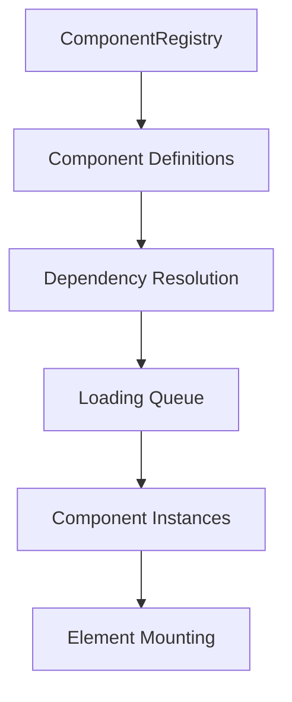

# Component Registry

The ComponentRegistry is the central system for registering, loading, and managing components in Parallelogram-JS. It handles component discovery, dependency resolution, and lifecycle management.

## Registry Architecture



## Basic Usage

### Creating a Registry

```javascript
import { ComponentRegistry } from '@parallelogram-js/core';

// Create registry with environment configuration
const registry = ComponentRegistry.create('production');

// Or create with custom options
const customRegistry = new ComponentRegistry({
  basePath: './components/',
  defaultPriority: 'normal',
  fileExtension: '.js',
  useMinified: false,
});
```

### Registering Components

```javascript
const componentRegistry = registry
  .component('toggle', '[data-toggle]', {
    priority: 'critical',
    loader: () => import('./Toggle.js'),
  })
  .component('modal', '[data-modal]', {
    priority: 'normal',
    dependsOn: ['toggle'],
    loader: () => import('./Modal.js'),
  })
  .component('carousel', '[data-carousel]', {
    priority: 'low',
    dependsOn: ['lazysrc'],
    loader: () => import('./Carousel.js'),
  });
```

## Component Configuration

### Required Properties

```javascript
registry.component(name, selector, options);
```

**Parameters:**

- `name` (string): Unique component identifier
- `selector` (string): CSS selector for finding component elements
- `options` (object): Component configuration options

**Required Options:**

- `loader` (function): Function that returns Promise resolving to component class

### Optional Properties

```javascript
registry.component('example', '[data-example]', {
  // Loading priority
  priority: 'critical' | 'normal' | 'low',

  // Component dependencies
  dependsOn: ['other-component'],

  // Custom loader function
  loader: () => import('./ExampleComponent.js'),

  // Custom export name (if not 'default')
  exportName: 'ExampleComponent',

  // Additional metadata
  metadata: {
    version: '1.0.0',
    description: 'Example component',
  },
});
```

## Priority System

### Priority Levels

```javascript
// Critical components load first
registry.component('critical-feature', '[data-critical]', {
  priority: 'critical',
  loader: () => import('./CriticalFeature.js'),
});

// Normal priority (default)
registry.component('standard-feature', '[data-standard]', {
  priority: 'normal', // or omit for default
  loader: () => import('./StandardFeature.js'),
});

// Low priority loads last
registry.component('enhancement', '[data-enhancement]', {
  priority: 'low',
  loader: () => import('./Enhancement.js'),
});
```

### Loading Order

Components are loaded in this order:

1. **Critical**: Essential functionality, loaded immediately
2. **Normal**: Standard features, loaded after critical
3. **Low**: Nice-to-have enhancements, loaded last

## Dependency Management

### Simple Dependencies

```javascript
registry
  .component('base-component', '[data-base]', {
    loader: () => import('./BaseComponent.js'),
  })
  .component('dependent-component', '[data-dependent]', {
    dependsOn: ['base-component'],
    loader: () => import('./DependentComponent.js'),
  });
```

### Multiple Dependencies

```javascript
registry.component('complex-component', '[data-complex]', {
  dependsOn: ['base-component', 'utility-component', 'api-service'],
  loader: () => import('./ComplexComponent.js'),
});
```

### Dependency Resolution

The registry automatically resolves dependencies:

```javascript
// Registry builds dependency graph and loading order
const loadOrder = registry._resolveDependencies();

// Example resolved order:
// 1. base-component (no dependencies)
// 2. utility-component (no dependencies)
// 3. api-service (no dependencies)
// 4. complex-component (depends on all above)
```

## Component Loading

### Loader Functions

```javascript
// Dynamic import loader
const loader = () => import('./Component.js');

// Static component loader for bundled components
const staticLoader = () => Promise.resolve({ default: ComponentClass });

// Custom loader with initialization
const customLoader = async () => {
  const module = await import('./Component.js');

  // Perform custom initialization
  await module.default.initialize();

  return module;
};
```

### Pre-compiled Component Factory

```javascript
// Used in demo for bundled components
function createComponentLoader(ComponentClass) {
  return () => Promise.resolve({ default: ComponentClass });
}

// Usage
registry.component('toggle', '[data-toggle]', {
  loader: createComponentLoader(Toggle),
});
```

## Registry Configuration

### Global Configuration

```javascript
// Configure registry with shared services
componentRegistry.configure({
  eventBus: new EventManager(),
  logger: new DevLogger(),
  router: new RouterManager(),
});
```

### Environment-Specific Setup

```javascript
// Production configuration
const prodRegistry = ComponentRegistry.create('production');

// Development configuration
const devRegistry = ComponentRegistry.create('development', {
  enableDebugLogging: true,
  loadSourceMaps: true,
});

// Custom environment
const customRegistry = ComponentRegistry.create('custom', {
  basePath: '/custom/components/',
  useMinified: true,
  enableLazyLoading: false,
});
```

## Component Discovery

### DOM Scanning

```javascript
// Scan entire document
const foundComponents = registry.scan(document);

// Scan specific container
const containerComponents = registry.scan(document.querySelector('#app'));

// Manual element specification
const specificComponents = registry.process([
  document.querySelector('[data-modal]'),
  document.querySelector('[data-carousel]'),
]);
```

### Discovery Process

```javascript
scan(container = document) {
    const discoveries = [];

    for (const config of this.registry) {
        // Find elements matching component selector
        const elements = container.querySelectorAll(config.selector);

        for (const element of elements) {
            discoveries.push({
                element,
                config,
                priority: config.priority
            });
        }
    }

    return this._sortByPriority(discoveries);
}
```

## Component Instantiation

### Instance Management

```javascript
class ComponentRegistry {
  async loadComponent(config) {
    // Load component module
    const ComponentModule = await config.loader();
    const ComponentClass = ComponentModule.default || ComponentModule[config.exportName];

    // Create instance with dependency injection
    const instance = new ComponentClass({
      eventBus: this.eventBus,
      logger: this.logger,
      router: this.router,
    });

    // Store instance for lifecycle management
    this.components.set(config.name, instance);

    return instance;
  }
}
```

### Element Mounting

```javascript
async mountComponents(discoveries) {
    // Group discoveries by component
    const grouped = this._groupByComponent(discoveries);

    for (const [componentName, elements] of grouped) {
        const component = this.components.get(componentName);

        // Mount component to each discovered element
        for (const element of elements) {
            try {
                component.mount(element);
            } catch (error) {
                this.logger?.error(`Failed to mount ${componentName}:`, error);
            }
        }
    }
}
```

## Advanced Features

### Conditional Loading

```javascript
registry.component('mobile-only', '[data-mobile-feature]', {
  loader: () => import('./MobileFeature.js'),
  condition: () => window.innerWidth < 768,
});

registry.component('modern-feature', '[data-modern]', {
  loader: () => import('./ModernFeature.js'),
  condition: () => 'IntersectionObserver' in window,
});
```

### Lazy Loading

```javascript
// Load component only when element becomes visible
registry.component('below-fold', '[data-lazy-component]', {
  loader: () => import('./LazyComponent.js'),
  loadWhen: 'visible', // or 'interaction', 'idle'
  rootMargin: '100px', // for intersection observer
});
```

### Component Metadata

```javascript
registry.component('analytics', '[data-analytics]', {
  loader: () => import('./Analytics.js'),
  metadata: {
    version: '2.1.0',
    dependencies: ['gtag'],
    description: 'Analytics tracking component',
    author: 'Team',
    category: 'tracking',
  },
});

// Access metadata
const metadata = registry.getComponentMetadata('analytics');
```

## Registry Events

### Event System Integration

```javascript
// Registry emits events during component lifecycle
registry.on('component:loading', config => {
  console.log(`Loading component: ${config.name}`);
});

registry.on('component:loaded', (config, instance) => {
  console.log(`Component loaded: ${config.name}`);
});

registry.on('component:mounted', (config, element) => {
  console.log(`Component mounted: ${config.name}`);
});

registry.on('component:error', (config, error) => {
  console.error(`Component error: ${config.name}`, error);
});
```

### Custom Event Handlers

```javascript
class CustomRegistry extends ComponentRegistry {
  onComponentLoad(config, instance) {
    // Custom logic when component loads
    this.trackComponentUsage(config.name);
    this.updatePerformanceMetrics(config);
  }

  onComponentError(config, error) {
    // Custom error handling
    this.reportError(config.name, error);
    this.loadFallbackComponent(config);
  }
}
```

## Performance Optimization

### Bundle Analysis

```javascript
// Track component loading performance
registry.on('component:loaded', (config, instance, loadTime) => {
  analytics.track('component_load', {
    name: config.name,
    loadTime,
    priority: config.priority,
  });
});
```

### Memory Management

```javascript
// Registry automatically handles cleanup
registry.destroy(); // Unmounts all components and cleans up

// Selective cleanup
registry.unmountComponent('component-name');

// Element-specific cleanup
registry.unmountElement(element);
```

### Caching Strategy

```javascript
// Registry caches loaded component classes
const cache = new Map();

async loadComponent(config) {
    // Check cache first
    if (cache.has(config.name)) {
        return cache.get(config.name);
    }

    // Load and cache
    const ComponentClass = await config.loader();
    cache.set(config.name, ComponentClass);

    return ComponentClass;
}
```

This registry system provides powerful, flexible component management while maintaining performance and developer experience.
