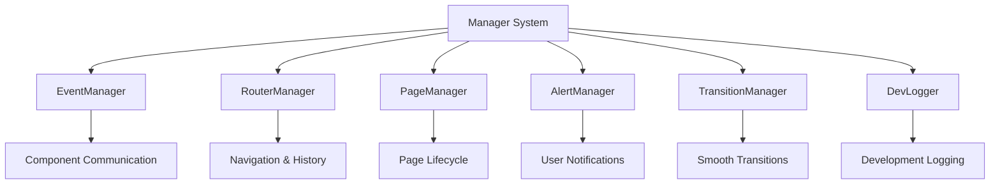

# Manager System

The Manager System provides core services and utilities that components depend on. Managers handle cross-cutting concerns like events, routing, page transitions, and logging.

## Manager Architecture



## EventManager

Central event system for component communication and global state management.

### Basic Usage

```javascript
import { EventManager } from '@peptolab/parallelogram';

const eventBus = new EventManager();

// Subscribe to events
const unsubscribe = eventBus.on('user:action', payload => {
  console.log('User performed action:', payload);
});

// Emit events
eventBus.emit('user:action', {
  action: 'click',
  element: button,
  timestamp: Date.now(),
});

// One-time listener
eventBus.once('app:ready', () => {
  console.log('Application is ready');
});

// Unsubscribe
unsubscribe();
```

### Event Patterns

```javascript
// Component lifecycle events
eventBus.emit('component:mounted', { name: 'modal', element });
eventBus.emit('component:unmounted', { name: 'modal', element });

// User interaction events
eventBus.emit('user:click', { target: element, coordinates: { x, y } });
eventBus.emit('user:scroll', { direction: 'down', position: scrollY });

// Application state events
eventBus.emit('app:loading', { component: 'data-table' });
eventBus.emit('app:error', { error, context: 'component-load' });

// Custom business logic events
eventBus.emit('cart:updated', { items: cartItems, total: cartTotal });
eventBus.emit('search:performed', { query, results: searchResults });
```

### Advanced Features

```javascript
class EventManager {
    // Event namespacing
    on('modal:*', callback); // Listen to all modal events

    // Event filtering
    on('user:click', callback, {
        filter: (payload) => payload.target.matches('button')
    });

    // Event transformation
    on('data:changed', callback, {
        transform: (payload) => ({ ...payload, timestamp: Date.now() })
    });

    // Error handling
    on('component:error', callback, {
        errorHandler: (error) => logger.error('Event handler failed:', error)
    });
}
```

## RouterManager

Client-side routing with history API integration and component integration.

### Basic Routing

```javascript
import { RouterManager } from '@peptolab/parallelogram';

const router = new RouterManager({
  eventBus,
  logger,
  enableHistory: true,
  basePath: '/',
});

// Define routes
router
  .route('/', 'home')
  .route('/about', 'about')
  .route('/products/:id', 'product-detail')
  .route('/search', 'search', {
    queryParams: ['q', 'category', 'sort'],
  });

// Navigate programmatically
router.navigate('/products/123');
router.navigate('/search?q=widgets&category=tools');

// Listen for route changes
router.on('route:changed', route => {
  console.log('Current route:', route);
});
```

### Route Configuration

```javascript
// Route with parameters and validation
router.route('/user/:userId', 'user-profile', {
  validate: {
    userId: /^\d+$/, // Numeric user IDs only
  },
  middleware: [requireAuth, loadUserData],
});

// Route with query parameters
router.route('/dashboard', 'dashboard', {
  queryParams: ['tab', 'filter', 'sort'],
  defaults: {
    tab: 'overview',
    sort: 'date',
  },
});

// Nested routes
router
  .route('/admin', 'admin-layout')
  .route('/admin/users', 'admin-users')
  .route('/admin/users/:id', 'admin-user-detail');
```

### Route Middleware

```javascript
// Authentication middleware
const requireAuth = (route, next) => {
  if (!user.isAuthenticated) {
    router.navigate('/login');
    return;
  }
  next();
};

// Data loading middleware
const loadUserData = async (route, next) => {
  const userId = route.params.userId;
  const userData = await api.getUser(userId);
  route.data = { user: userData };
  next();
};

// Apply middleware
router.route('/profile/:userId', 'profile', {
  middleware: [requireAuth, loadUserData],
});
```

### Router Events

```javascript
// Route lifecycle events
router.on('route:before', (newRoute, oldRoute) => {
  // Before route change
  showLoadingSpinner();
});

router.on('route:changed', route => {
  // After route change
  hideLoadingSpinner();
  updateNavigation(route);
});

router.on('route:error', (error, route) => {
  // Route error handling
  showErrorPage(error);
});
```

## PageManager

Manages page-level lifecycle, transitions, and Single Page Application (SPA) behavior.

### Page Registration

```javascript
import { PageManager } from '@peptolab/parallelogram';

const pageManager = new PageManager({
  eventBus,
  router,
  logger,
  pages: {
    home: HomePage,
    about: AboutPage,
    contact: ContactPage,
  },
});

// Dynamic page registration
pageManager.registerPage('blog', BlogPage);
pageManager.registerPage('product-detail', ProductDetailPage);
```

### Page Class Structure

```javascript
class HomePage {
  constructor({ eventBus, router, logger }) {
    this.eventBus = eventBus;
    this.router = router;
    this.logger = logger;
  }

  // Called when page is about to load
  async onEnter(route) {
    this.logger.info('Entering home page');

    // Load page-specific data
    this.data = await this.loadPageData();

    // Set page meta
    document.title = 'Home - My App';
    this.updateMetaTags();
  }

  // Called when page is active
  onReady() {
    // Initialize page-specific components
    this.initializeHeroSection();
    this.bindPageEvents();

    // Emit ready event
    this.eventBus.emit('page:ready', { page: 'home' });
  }

  // Called when leaving page
  async onExit(newRoute) {
    // Cleanup page-specific resources
    this.unbindPageEvents();
    this.cleanupComponents();

    // Optionally prevent navigation
    if (this.hasUnsavedChanges()) {
      return confirm('Leave page with unsaved changes?');
    }
  }

  // Handle errors on this page
  onError(error) {
    this.logger.error('Page error:', error);
    this.showErrorMessage(error.message);
  }
}
```

### Page Transitions

```javascript
// Configure page transitions
pageManager.setTransition('default', {
  duration: 300,
  easing: 'ease-in-out',
  effects: ['fade', 'slide'],
});

pageManager.setTransition('modal-to-page', {
  duration: 500,
  easing: 'cubic-bezier(0.4, 0, 0.2, 1)',
  effects: ['scale', 'fade'],
});

// Custom transition logic
pageManager.transition('home', 'about', {
  beforeTransition: async () => {
    await this.saveCurrentPageState();
  },
  afterTransition: () => {
    this.restoreScrollPosition();
  },
});
```

## AlertManager

User notification system for success messages, errors, warnings, and confirmations.

### Basic Notifications

```javascript
import { AlertManager } from '@peptolab/parallelogram';

const alerts = new AlertManager({
  eventBus,
  container: document.getElementById('alerts'),
  defaultDuration: 5000,
});

// Success notification
alerts.success('Profile updated successfully!');

// Error notification
alerts.error('Failed to save changes. Please try again.');

// Warning notification
alerts.warning('This action cannot be undone.');

// Info notification
alerts.info('New features are available in the settings.');
```

### Advanced Alert Options

```javascript
// Persistent alert
alerts.error('Connection lost. Please check your internet.', {
  persistent: true,
  actions: [
    { text: 'Retry', action: () => retryConnection() },
    { text: 'Dismiss', action: 'dismiss' },
  ],
});

// Custom positioning
alerts.success('File uploaded!', {
  position: 'top-right',
  duration: 3000,
  animation: 'slide-in',
});

// Rich content alert
alerts.custom({
  type: 'info',
  title: 'Update Available',
  message: 'Version 2.0 includes new features and improvements.',
  icon: 'update',
  actions: [
    { text: 'Update Now', action: () => performUpdate(), primary: true },
    { text: 'Later', action: 'dismiss' },
  ],
});
```

### Alert Queue Management

```javascript
// Queue multiple alerts
alerts.queue(
  [
    { type: 'info', message: 'Processing request...' },
    { type: 'success', message: 'Request completed!' },
    { type: 'info', message: 'Redirecting...' },
  ],
  {
    sequence: true, // Show one at a time
    interval: 2000, // 2 second intervals
  }
);

// Alert groups
alerts.group('form-validation', [
  { type: 'error', message: 'Email is required' },
  { type: 'error', message: 'Password must be at least 8 characters' },
]);

// Clear all alerts in group
alerts.clearGroup('form-validation');
```

## TransitionManager

Smooth transitions and animations between states and pages.

### Basic Transitions

```javascript
import { TransitionManager } from '@peptolab/parallelogram';

const transitions = new TransitionManager({
  eventBus,
  defaultDuration: 300,
  defaultEasing: 'ease-in-out',
});

// Element transitions
await transitions.fadeIn(element);
await transitions.fadeOut(element);
await transitions.slideUp(element);
await transitions.slideDown(element);

// Custom transition
await transitions.custom(element, {
  from: { opacity: 0, transform: 'translateY(20px)' },
  to: { opacity: 1, transform: 'translateY(0)' },
  duration: 400,
  easing: 'cubic-bezier(0.4, 0, 0.2, 1)',
});
```

### Page Transitions

```javascript
// Transition between page content
await transitions.pageTransition(oldContent, newContent, {
  type: 'crossfade',
  duration: 500,
});

// Modal transitions
await transitions.modalTransition(modal, {
  enter: 'scale-fade-in',
  exit: 'scale-fade-out',
  backdrop: true,
});

// List item transitions
await transitions.listTransition(items, {
  stagger: 100, // 100ms delay between items
  animation: 'slide-in-left',
});
```

## DevLogger

Development logging with levels, filtering, and performance tracking.

### Basic Logging

```javascript
import { DevLogger } from '@peptolab/parallelogram';

const logger = new DevLogger(
  {
    level: 'debug',
    prefix: 'MyApp',
    enablePerformance: true,
  },
  true
); // Enable logging

// Log levels
logger.debug('Debug information');
logger.info('General information');
logger.warn('Warning message');
logger.error('Error occurred', error);
```

### Advanced Logging

```javascript
// Contextual logging
logger.withContext({ component: 'Modal', element: modalEl }).info('Modal opened');

// Performance tracking
logger.time('component-load');
// ... component loading logic
logger.timeEnd('component-load');

// Grouped logging
logger.group('Component Initialization');
logger.info('Loading dependencies');
logger.info('Parsing configuration');
logger.groupEnd();

// Conditional logging
logger.debug(() => {
  // Only executed if debug level is enabled
  return `Complex debug data: ${JSON.stringify(complexObject)}`;
});
```

### Logger Configuration

```javascript
// Environment-specific configuration
const prodLogger = new DevLogger(
  {
    level: 'error',
    enablePerformance: false,
    output: 'service', // Send to logging service
  },
  process.env.NODE_ENV !== 'production'
);

const devLogger = new DevLogger(
  {
    level: 'debug',
    enablePerformance: true,
    enableStack: true,
    colorize: true,
  },
  true
);
```

## Manager Integration

### Dependency Injection

```javascript
// Managers are injected into components
class MyComponent extends BaseComponent {
  constructor({ eventBus, logger, router }) {
    super({ eventBus, logger, router });

    // Access to all manager services
    this.alerts = new AlertManager({ eventBus });
    this.transitions = new TransitionManager({ eventBus });
  }

  _init(element) {
    // Use managers in component logic
    this.logger.info('Initializing component');

    this.eventBus.on('user:action', this._handleAction.bind(this));

    return state;
  }

  async _handleAction(action) {
    try {
      await this.performAction(action);
      this.alerts.success('Action completed!');
    } catch (error) {
      this.logger.error('Action failed:', error);
      this.alerts.error('Action failed. Please try again.');
    }
  }
}
```

### Cross-Manager Communication

```javascript
// Managers communicate through events
class RouterManager {
  navigate(path) {
    // Emit before navigation
    this.eventBus.emit('router:before', { path });

    // Perform navigation
    this.updateHistory(path);

    // Emit after navigation
    this.eventBus.emit('router:changed', { path, route: this.current });
  }
}

// PageManager listens for router events
class PageManager {
  constructor(options) {
    super(options);

    this.router.on('router:changed', this._handleRouteChange.bind(this));
  }

  async _handleRouteChange(route) {
    await this.transitionTo(route.name);
    this.eventBus.emit('page:changed', route);
  }
}
```

This manager system provides the foundational services that make the component system powerful and cohesive.
