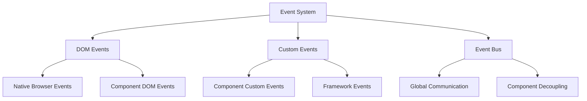

# Event System

The Parallelogram-JS event system provides powerful component communication through a combination of DOM events, custom events, and a global event bus. This document explains the event architecture and patterns.

## Event Architecture



## Event Types

### 1. DOM Events

Standard browser events enhanced with framework patterns:

```javascript
// Component listening to DOM events
class Toggle extends BaseComponent {
  _setupEventListeners(element, state) {
    // Use AbortController for cleanup
    element.addEventListener(
      'click',
      event => {
        this._handleToggle(event, element, state);
      },
      { signal: state.controller.signal }
    );

    // Keyboard events
    element.addEventListener(
      'keydown',
      event => {
        if (event.key === 'Enter' || event.key === ' ') {
          event.preventDefault();
          this._handleToggle(event, element, state);
        }
      },
      { signal: state.controller.signal }
    );
  }
}
```

### 2. Custom DOM Events

Components dispatch custom events for direct communication:

```javascript
class Modal extends BaseComponent {
  _open(element, state) {
    // Update state
    this._setState(element, state, { isOpen: true });

    // Dispatch custom event
    const openEvent = new CustomEvent('modal:open', {
      bubbles: true,
      cancelable: true,
      detail: {
        modal: element,
        trigger: state.trigger,
        timestamp: Date.now(),
      },
    });

    element.dispatchEvent(openEvent);

    // Check if event was cancelled
    if (openEvent.defaultPrevented) {
      this._setState(element, state, { isOpen: false });
      return;
    }
  }

  _close(element, state) {
    // Dispatch closing event (preventable)
    const closingEvent = new CustomEvent('modal:closing', {
      bubbles: true,
      cancelable: true,
      detail: { modal: element },
    });

    element.dispatchEvent(closingEvent);

    if (closingEvent.defaultPrevented) {
      return; // Don't close if prevented
    }

    // Update state
    this._setState(element, state, { isOpen: false });

    // Dispatch closed event (not preventable)
    element.dispatchEvent(
      new CustomEvent('modal:closed', {
        bubbles: true,
        detail: { modal: element },
      })
    );
  }
}
```

### 3. Event Bus Communication

Global event system for loose component coupling:

```javascript
class Component extends BaseComponent {
  _init(element) {
    const state = {
      /* ... */
    };

    // Listen to global events
    this.eventBus.on('user:login', this._handleUserLogin.bind(this));
    this.eventBus.on('app:theme-changed', this._handleThemeChange.bind(this));
    this.eventBus.on('route:changed', this._handleRouteChange.bind(this));

    // Component-specific events
    this.eventBus.on('modal:*', this._handleModalEvents.bind(this));

    return state;
  }

  _performAction(data) {
    // Emit global event
    this.eventBus.emit('user:action', {
      component: this.constructor.name,
      action: 'performed',
      data,
      timestamp: Date.now(),
    });
  }
}
```

## Event Patterns

### 1. Event Lifecycle Pattern

```javascript
// Components follow consistent event naming
class DataTable extends BaseComponent {
  async _loadData(element, state) {
    // Before event
    this.eventBus.emit('datatable:loading', {
      element,
      query: state.currentQuery,
    });

    try {
      // Perform action
      const data = await this._fetchData(state.currentQuery);

      // Success event
      this.eventBus.emit('datatable:loaded', {
        element,
        data,
        count: data.length,
      });
    } catch (error) {
      // Error event
      this.eventBus.emit('datatable:error', {
        element,
        error,
        query: state.currentQuery,
      });
    }
  }
}
```

### 2. Event Delegation Pattern

```javascript
class FormEnhancer extends BaseComponent {
  _init(element) {
    const state = {
      /* ... */
    };

    // Delegate events for dynamic content
    element.addEventListener(
      'click',
      event => {
        // Handle different types of clicks
        if (event.target.matches('[data-form-submit]')) {
          this._handleSubmit(event, element, state);
        } else if (event.target.matches('[data-form-reset]')) {
          this._handleReset(event, element, state);
        } else if (event.target.matches('[data-form-validate]')) {
          this._handleValidate(event, element, state);
        }
      },
      { signal: state.controller.signal }
    );

    return state;
  }
}
```

### 3. Event Composition Pattern

```javascript
class ComplexComponent extends BaseComponent {
  _init(element) {
    const state = {
      /* ... */
    };

    // Compose multiple event sources
    this._setupDOMEvents(element, state);
    this._setupGlobalEvents(state);
    this._setupComponentEvents(element, state);

    return state;
  }

  _setupDOMEvents(element, state) {
    // Direct DOM interaction
    element.addEventListener('click', this._handleClick.bind(this), {
      signal: state.controller.signal,
    });
  }

  _setupGlobalEvents(state) {
    // Global application events
    this.eventBus.on('app:resize', this._handleResize.bind(this));
    this.eventBus.on('app:focus', this._handleFocusChange.bind(this));
  }

  _setupComponentEvents(element, state) {
    // Inter-component communication
    this.eventBus.on('modal:opened', this._handleModalOpened.bind(this));
    this.eventBus.on('form:submitted', this._handleFormSubmitted.bind(this));
  }
}
```

## Event Communication Patterns

### 1. Parent-Child Communication

```javascript
// Parent component
class TabContainer extends BaseComponent {
  _init(element) {
    const state = {
      /* ... */
    };

    // Listen for tab events
    element.addEventListener('tab:selected', event => {
      this._handleTabSelection(event, element, state);
    });

    return state;
  }

  _handleTabSelection(event, element, state) {
    const selectedTab = event.detail.tab;

    // Update state
    state.activeTab = selectedTab;

    // Notify other tabs
    const tabs = element.querySelectorAll('[data-tab]');
    tabs.forEach(tab => {
      const isActive = tab === selectedTab;
      tab.classList.toggle('active', isActive);
      tab.setAttribute('aria-selected', isActive);
    });
  }
}

// Child component
class Tab extends BaseComponent {
  _handleActivation(element, state) {
    // Notify parent
    const event = new CustomEvent('tab:selected', {
      bubbles: true,
      detail: { tab: element },
    });

    element.dispatchEvent(event);
  }
}
```

### 2. Sibling Component Communication

```javascript
// Component A
class SearchComponent extends BaseComponent {
  _performSearch(query) {
    // Emit search event
    this.eventBus.emit('search:performed', {
      query,
      timestamp: Date.now(),
    });
  }
}

// Component B
class ResultsComponent extends BaseComponent {
  _init(element) {
    const state = {
      /* ... */
    };

    // Listen for search events
    this.eventBus.on('search:performed', data => {
      this._displayResults(element, state, data.query);
    });

    return state;
  }
}

// Component C
class HistoryComponent extends BaseComponent {
  _init(element) {
    const state = { searchHistory: [] };

    // Also listen for search events
    this.eventBus.on('search:performed', data => {
      this._addToHistory(state, data.query);
    });

    return state;
  }
}
```

### 3. Service-Component Communication

```javascript
// Service layer
class DataService {
  constructor(eventBus) {
    this.eventBus = eventBus;
  }

  async saveData(data) {
    this.eventBus.emit('data:saving', { data });

    try {
      const result = await api.save(data);
      this.eventBus.emit('data:saved', { data, result });
      return result;
    } catch (error) {
      this.eventBus.emit('data:error', { data, error });
      throw error;
    }
  }
}

// Components listen to service events
class FormComponent extends BaseComponent {
  _init(element) {
    const state = {
      /* ... */
    };

    // Listen to data service events
    this.eventBus.on('data:saving', this._handleSaving.bind(this));
    this.eventBus.on('data:saved', this._handleSaved.bind(this));
    this.eventBus.on('data:error', this._handleError.bind(this));

    return state;
  }
}
```

## Event Bus Features

### 1. Event Namespacing

```javascript
// Namespace events by component or feature
this.eventBus.emit('modal:opened', data);
this.eventBus.emit('modal:closed', data);
this.eventBus.emit('modal:error', data);

// Listen to all events in namespace
this.eventBus.on('modal:*', (event, data) => {
  console.log(`Modal event: ${event}`, data);
});

// Business domain events
this.eventBus.emit('user:login', userData);
this.eventBus.emit('user:logout', userData);
this.eventBus.emit('cart:updated', cartData);
this.eventBus.emit('order:completed', orderData);
```

### 2. Event Filtering

```javascript
// Listen only to specific event conditions
this.eventBus.on(
  'user:click',
  data => {
    // Handle all clicks
  },
  {
    filter: data => data.target.matches('button'),
    // Only handle button clicks
  }
);

// Complex filtering
this.eventBus.on(
  'form:submitted',
  data => {
    // Handle form submission
  },
  {
    filter: data => {
      return data.form.matches('.important') && data.isValid && data.user.hasPermission;
    },
  }
);
```

### 3. Event Transformation

```javascript
// Transform event data before handling
this.eventBus.on(
  'api:response',
  data => {
    // Receive transformed data
    console.log(data); // { ...originalData, timestamp, processed: true }
  },
  {
    transform: data => ({
      ...data,
      timestamp: Date.now(),
      processed: true,
    }),
  }
);
```

### 4. Event Debouncing

```javascript
// Debounce rapid events
this.eventBus.on(
  'user:scroll',
  data => {
    // Only fires once per 100ms
    this._updateScrollPosition(data);
  },
  {
    debounce: 100,
  }
);

// Throttle events
this.eventBus.on(
  'mouse:move',
  data => {
    // Fires at most once per 16ms (~60fps)
    this._updateMousePosition(data);
  },
  {
    throttle: 16,
  }
);
```

## Error Handling in Events

### 1. Event Handler Errors

```javascript
class EventManager {
  emit(event, payload) {
    const listeners = this.listeners.get(event);
    if (!listeners) return;

    for (const callback of listeners) {
      try {
        callback(payload);
      } catch (error) {
        this.logger?.error(`Event handler error for '${event}':`, error);

        // Emit error event
        this.emit('event:error', {
          originalEvent: event,
          payload,
          error,
          handler: callback,
        });
      }
    }
  }
}
```

### 2. Component Error Recovery

```javascript
class Component extends BaseComponent {
  _init(element) {
    const state = {
      /* ... */
    };

    // Handle event bus errors
    this.eventBus.on('event:error', errorData => {
      if (errorData.originalEvent.startsWith(this.constructor.name.toLowerCase())) {
        this._handleComponentError(errorData);
      }
    });

    return state;
  }

  _handleComponentError(errorData) {
    // Log error
    this.logger.error('Component event error:', errorData.error);

    // Attempt recovery
    try {
      this._recoverFromError(errorData);
    } catch (recoveryError) {
      this.logger.error('Failed to recover from error:', recoveryError);
      this._fallbackBehavior();
    }
  }
}
```

## Performance Optimization

### 1. Event Listener Management

```javascript
class Component extends BaseComponent {
  _init(element) {
    const state = {
      controller: new AbortController(),
      cleanup: () => {
        // All listeners are automatically cleaned up
        state.controller.abort();
      },
    };

    // All DOM listeners use AbortController
    element.addEventListener('click', handler, {
      signal: state.controller.signal,
    });

    document.addEventListener('scroll', handler, {
      signal: state.controller.signal,
    });

    return state;
  }
}
```

### 2. Event Bus Optimization

```javascript
// Efficient event bus with cleanup
class EventBus {
  on(event, callback) {
    // Return unsubscribe function
    return () => this.off(event, callback);
  }

  // Automatic cleanup when components unmount
  cleanup(component) {
    // Remove all listeners for a component
    for (const [event, listeners] of this.listeners) {
      const filtered = listeners.filter(l => l.component !== component);
      this.listeners.set(event, filtered);
    }
  }
}
```

### 3. Memory Leak Prevention

```javascript
class Component extends BaseComponent {
  unmount(element) {
    const state = this.elements.get(element);
    if (!state) return;

    try {
      // Cleanup DOM event listeners
      state.controller.abort();

      // Cleanup event bus listeners
      this.eventBus.cleanup(this);

      // Component-specific cleanup
      state.cleanup?.();
    } finally {
      // Remove from WeakMap
      this.elements.delete(element);
    }
  }
}
```

This event system provides powerful, flexible communication while maintaining performance and preventing memory leaks.
