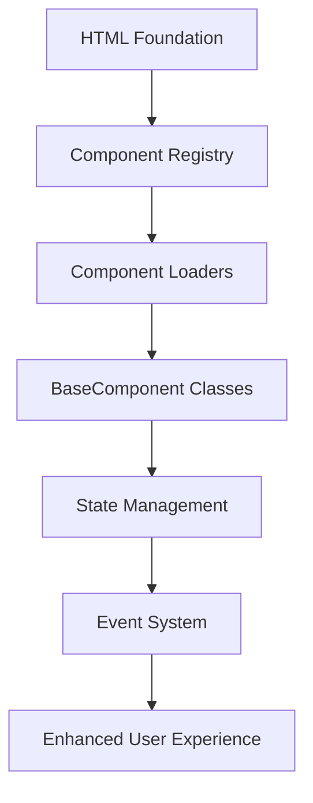

# Parallelogram-JS Framework Documentation

A comprehensive guide to the Parallelogram-JS progressive enhancement framework architecture, component system, and JavaScript workflow.

## 📖 Documentation Structure

This documentation is organized into focused sections that explain different aspects of the framework:

### Core Architecture

- **[Framework Overview](./01-framework-overview.md)** - High-level architecture and design principles
- **[Application Lifecycle](./02-application-lifecycle.md)** - From initialization to component loading
- **[Component System](./03-component-system.md)** - BaseComponent class and component patterns

### System Components

- **[Component Registry](./04-component-registry.md)** - Component registration and dependency management
- **[Manager System](./05-manager-system.md)** - EventManager, RouterManager, PageManager, etc.
- **[State Management](./06-state-management.md)** - Element state tracking and lifecycle

### Advanced Topics

- **[Event System](./07-event-system.md)** - Event bus, emitters, and component communication
- **[Loading Strategies](./08-loading-strategies.md)** - Component loaders and progressive loading
- **[Performance Optimization](./09-performance-optimization.md)** - Lazy loading, memory management, and best practices

### Development Guide

- **[Creating Components](./10-creating-components.md)** - Step-by-step component development guide
- **[Web Components](./11-web-components.md)** - Integration with native web components (PModal, PSelect, etc.)
- **[Demo Integration](./12-demo-integration.md)** - How the demo site integrates all systems

## 🚀 Quick Start

For developers new to the framework, start with:

1. [Framework Overview](./01-framework-overview.md) - Understand the core concepts
2. [Application Lifecycle](./02-application-lifecycle.md) - Learn the initialization flow
3. [Creating Components](./10-creating-components.md) - Build your first component

## 🎯 Architecture Summary

Parallelogram-JS follows a progressive enhancement philosophy:

**Core Principles:**

- **HTML-First**: Components enhance existing markup
- **Progressive**: Works without JavaScript, enhanced with it
- **Modular**: Components are independent and reusable
- **Performance**: Lazy loading and efficient state management
- **Accessible**: Built-in accessibility patterns and focus management

## 📝 Usage Context

This documentation serves dual purposes:

1. **Developer Reference** - Complete API and architecture documentation
2. **Demo Content** - Structured content for the demo site documentation section

Each file is written to be both technically comprehensive and demo-friendly.
