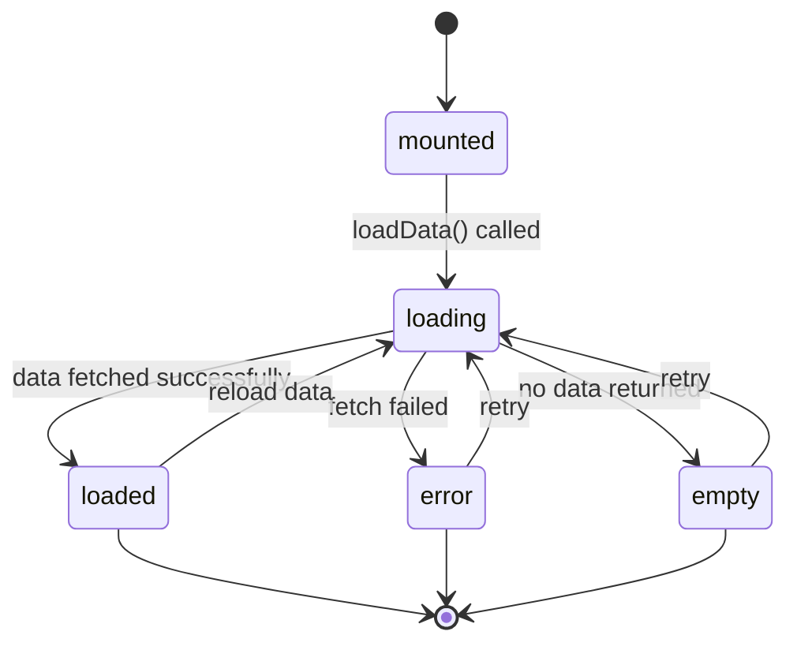

# DataTable State Management

## Overview

The DataTable component uses state-based CSS with data attributes to manage asynchronous operations, displaying loading indicators, error states, and empty data states.

## State Machine



## States

### `mounted` (ComponentStates.MOUNTED)
- **Initial state** - Table has been initialized with existing data
- **CSS**: Normal table rendering
- **Transitions to**: `loading` when `loadData()` is called

### `loading` (ExtendedStates.LOADING)
- **Async state** - Data is being fetched from server
- **CSS**: Overlay with spinner, pointer-events disabled
- **Duration**: Until fetch completes or fails
- **Transitions to**: `loaded`, `error`, or `empty`

### `loaded` (ExtendedStates.LOADED)
- **Success state** - Data has been successfully fetched and rendered
- **CSS**: Normal table rendering
- **Transitions to**: `loading` when data is reloaded

### `error` (ComponentStates.ERROR)
- **Error state** - Data fetch failed
- **CSS**: Red border, error message displayed
- **Transitions to**: `loading` when retry is attempted

### `empty`
- **Empty state** - Fetch succeeded but returned no data
- **CSS**: "No data available" message in tbody
- **Transitions to**: `loading` when retry is attempted

## Implementation

### JavaScript

#### Importing States

```javascript
import { BaseComponent } from '@parallelogram-js/core';
import { ComponentStates, ExtendedStates } from '../core/ComponentStates.js';
```

#### Initialization

```javascript
_init(element) {
  const state = super._init(element);

  /* Initialize with mounted state */
  element.setAttribute('data-datatable', ComponentStates.MOUNTED);

  /* Store state properties */
  state.errorMessage = null;

  // ... rest of initialization
}
```

#### Loading Data Asynchronously

```javascript
async loadData(element, url, rowMapper) {
  const state = this.getState(element);
  if (!state) return;

  try {
    /* Set loading state */
    element.setAttribute('data-datatable', ExtendedStates.LOADING);
    state.errorMessage = null;

    /* Fetch data */
    const response = await fetch(url);
    if (!response.ok) {
      throw new Error(`HTTP ${response.status}: ${response.statusText}`);
    }

    const data = await response.json();

    /* Check for empty data */
    if (data.length === 0) {
      element.setAttribute('data-datatable', 'empty');
      state.originalRows = [];
      state.filteredRows = [];
      this._render(element, state);
      return;
    }

    /* Convert data to table rows */
    const rows = data.map(item => rowMapper(item));
    state.originalRows = rows;
    state.filteredRows = [...rows];

    /* Set loaded state */
    element.setAttribute('data-datatable', ExtendedStates.LOADED);

    this._render(element, state);
  } catch (error) {
    /* Set error state */
    element.setAttribute('data-datatable', ComponentStates.ERROR);
    element.setAttribute('data-error-message', error.message);
    state.errorMessage = error.message;

    this._dispatch(element, 'datatable:error', { error });
  }
}
```

#### Clearing Errors

```javascript
clearError(element) {
  const state = this.getState(element);
  if (!state) return;

  state.errorMessage = null;
  element.removeAttribute('data-error-message');
  element.setAttribute('data-datatable', ComponentStates.MOUNTED);
}
```

## CSS Integration

State-based selectors provide visual feedback:

```scss
/* Loading state with spinner overlay */
[data-datatable='loading'] {
  pointer-events: none;
  position: relative;
  opacity: 0.6;

  &::after {
    content: '';
    position: absolute;
    inset: 0;
    background: rgba(255, 255, 255, 0.9);
    display: flex;
    align-items: center;
    justify-content: center;
    z-index: 10;
    /* Animated spinner using SVG data URL */
    background-image: url("data:image/svg+xml,...");
    background-repeat: no-repeat;
    background-position: center;
  }
}

/* Error state with red border and message */
[data-datatable='error'] {
  border: 2px solid var(--brand-danger, #ef4444);
  background-color: rgba(239, 68, 68, 0.05);

  &::before {
    content: attr(data-error-message);
    display: block;
    padding: 1rem;
    background: rgba(239, 68, 68, 0.1);
    border: 1px solid var(--brand-danger, #ef4444);
    border-radius: 4px;
    color: var(--brand-danger, #ef4444);
    font-weight: 500;
    margin-bottom: 1rem;
  }
}

/* Empty state message */
[data-datatable='empty'] {
  tbody {
    &::after {
      content: 'No data available';
      display: table-row;
      text-align: center;
      padding: 2rem;
      color: #6b7280;
      font-style: italic;
    }
  }
}

/* Normal states */
[data-datatable='loaded'],
[data-datatable='mounted'] {
  /* No special styling */
}
```

## Events

The DataTable component dispatches events at key lifecycle points:

### `datatable:mounted`
Fired when table is initialized
```javascript
{
  element: HTMLElement,
  config: Object
}
```

### `datatable:loaded`
Fired when data is successfully loaded
```javascript
{
  element: HTMLElement,
  url: string,
  rowCount: number
}
```

### `datatable:error`
Fired when data loading fails
```javascript
{
  element: HTMLElement,
  error: Error,
  url: string,
  message: string
}
```

### `datatable:empty`
Fired when loaded data is empty
```javascript
{
  element: HTMLElement,
  url: string
}
```

### `datatable:rendered`
Fired after table is re-rendered
```javascript
{
  element: HTMLElement,
  totalRows: number,
  filteredRows: number,
  displayedRows: number
}
```

## Usage Example

### HTML

```html
<table id="products-table"
       data-datatable
       data-datatable-sortable="true"
       data-datatable-filterable="true"
       data-datatable-paginate="10">
  <thead>
    <tr>
      <th data-sort="name">Product Name</th>
      <th data-sort="price" data-sort-type="number">Price</th>
      <th data-sort="stock" data-sort-type="number">Stock</th>
    </tr>
  </thead>
  <tbody>
    <!-- Will be populated by loadData() -->
  </tbody>
</table>
```

### JavaScript API

```javascript
import { DataTable } from '@parallelogram-js/components';

const table = document.querySelector('#products-table');
const dataTable = new DataTable();

/* Initialize table */
dataTable.mount(table);

/* Load data from API */
dataTable.loadData(
  table,
  '/api/products',
  (product) => {
    /* Row mapper function - convert data to TR element */
    const row = document.createElement('tr');
    row.innerHTML = `
      <td>${product.name}</td>
      <td>$${product.price}</td>
      <td>${product.stock}</td>
    `;
    return row;
  }
);

/* Listen for events */
table.addEventListener('datatable:loaded', (event) => {
  console.log(`Loaded ${event.detail.rowCount} products`);
});

table.addEventListener('datatable:error', (event) => {
  console.error('Failed to load data:', event.detail.message);

  /* Optionally show retry button */
  showRetryButton(() => {
    dataTable.loadData(table, '/api/products', rowMapper);
  });
});

/* Clear error state */
document.querySelector('#retry-btn').addEventListener('click', () => {
  dataTable.clearError(table);
  dataTable.loadData(table, '/api/products', rowMapper);
});
```

### Monitoring State Changes

```javascript
/* Check current state */
const currentState = table.getAttribute('data-datatable');
console.log('Current state:', currentState); // "loading", "loaded", "error", etc.

/* Watch for state changes using MutationObserver */
const observer = new MutationObserver((mutations) => {
  mutations.forEach((mutation) => {
    if (mutation.attributeName === 'data-datatable') {
      const newState = table.getAttribute('data-datatable');
      console.log('State changed to:', newState);
    }
  });
});

observer.observe(table, {
  attributes: true,
  attributeFilter: ['data-datatable']
});
```

## Benefits

### User Experience
- **Visual feedback** - Spinner shows loading progress
- **Error recovery** - Clear error messages with retry capability
- **Empty states** - Graceful handling of no-data scenarios

### Developer Experience
- **Simple API** - `loadData()` handles all state transitions
- **Event-driven** - React to state changes via events
- **CSS-based UI** - No JavaScript DOM manipulation for visual states

### Performance
- **Non-blocking** - Async operations don't freeze UI
- **Efficient rendering** - Only updates necessary DOM elements
- **State isolation** - Each table manages its own state independently

## Configuration

### Error Message Customization

The error message is displayed via CSS `::before` pseudo-element reading the `data-error-message` attribute:

```javascript
/* Custom error messages */
try {
  // ... fetch data
} catch (error) {
  const friendlyMessage = error.status === 404
    ? 'Products not found'
    : 'Unable to load products. Please try again.';

  element.setAttribute('data-error-message', friendlyMessage);
}
```

### Empty State Customization

Override the empty state message via CSS:

```css
#products-table[data-datatable='empty'] tbody::after {
  content: 'No products available at this time';
}
```

## Related Documentation

- [ComponentStates.js](/src/core/ComponentStates.js) - Standard state values
- [Modal State Management](/docs/guides/modal-state-management.md) - Similar async patterns
- [Creating Components](/docs/guides/creating-components.md) - Component architecture

## Best Practices

1. **Always use row mapper** - Convert API data to DOM elements consistently
2. **Handle errors gracefully** - Provide clear error messages and retry options
3. **Show loading states** - Give users feedback during async operations
4. **Validate data** - Check response format before processing
5. **Use events** - React to state changes rather than polling
6. **Clear errors** - Reset error state before retrying operations

## Architecture Notes

### Why Async State Management?

DataTable needs async states because:

1. **Remote data** - Tables often load data from APIs
2. **User feedback** - Long operations need progress indicators
3. **Error handling** - Network failures must be communicated clearly
4. **Retry logic** - Users need ability to retry failed operations

### State vs. Loading Flag

Instead of a simple boolean `isLoading` flag, DataTable uses explicit states because:

- **Multiple outcomes** - Loading can result in loaded, error, or empty
- **CSS integration** - States enable declarative styling
- **Debugging** - State visible in DevTools as attribute
- **Framework consistency** - Matches other components' patterns

### Error Message Storage

Error messages are stored in two places:

1. **State object** - For JavaScript access (`state.errorMessage`)
2. **DOM attribute** - For CSS display (`data-error-message`)

This dual storage enables both programmatic access and declarative CSS-based display.