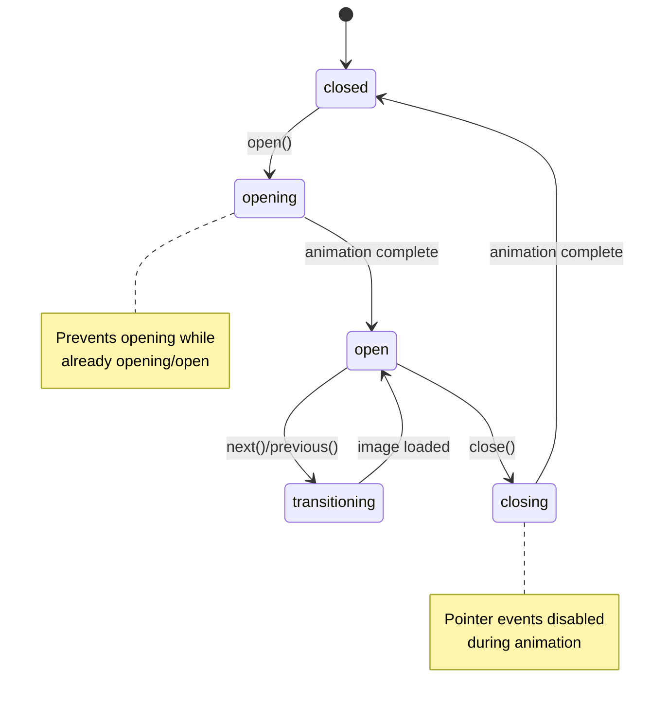

# Lightbox Component - State Management Guide

**Component**: `Lightbox.js`
**Status**: ✅ Complete with State-Based CSS
**Last Updated**: 2025-11-19

---

## Overview

The Lightbox component is an image/media gallery viewer with proper state management. It uses state-based CSS with the `data-lightbox` attribute to handle smooth animations between states.

## State Machine

### States

The Lightbox component uses five states:

1. **`closed`** - Lightbox is not visible
2. **`opening`** - Lightbox is transitioning in (fade in animation)
3. **`open`** - Lightbox is fully visible and interactive
4. **`transitioning`** - Lightbox is changing images (slide animation)
5. **`closing`** - Lightbox is transitioning out (fade out animation)

### State Transitions



### Transition Rules

- **From `closed`**: Can transition to `opening` when gallery image is clicked
- **From `opening`**: Automatically transitions to `open` after fade-in animation completes
- **From `open`**: Can transition to `transitioning` (when navigating images) or `closing` (when closing)
- **From `transitioning`**: Automatically transitions back to `open` after image slide animation
- **From `closing`**: Automatically transitions to `closed` after fade-out animation completes

---

## Implementation

### Key Improvements

#### 1. **Proper State Tracking**

**Before:**
```javascript
// Instance-level state (problematic with multiple lightboxes)
this.isOpen = false;
this.currentGallery = [];
this.currentIndex = 0;
this.isTransitioning = false;
```

**After:**
```javascript
// State stored per element via BaseComponent
state.lightboxState = 'closed';  // 'closed' | 'opening' | 'open' | 'transitioning' | 'closing'
state.currentIndex = 0;
state.galleryElements = [];
```

#### 2. **State-Based Attributes (Not Classes)**

**Before:**
```javascript
// Manual class management
this.lightboxElement.classList.add('show');
```

**After:**
```javascript
// Automatic state-based data attribute
// State exposed via [data-lightbox="state"] attribute
this._setState(element, 'open');
// Sets: <div data-lightbox="open" class="lightbox__overlay">
```

### 4. **Configuration Stored in State**

**Before:**
```javascript
// Configuration stored separately
this.currentConfig = config;
```

**After:**
```javascript
// Configuration stored in element state
state.config = this._getConfiguration(element);
```

### 5. **Proper Public API**

**Before:**
```javascript
// Public methods use dummy config or missing state
next() {
  const config = { showNavigation: true, keyNavigation: true };
  this._nextImage(config);  // Missing element context!
}
```

**After:**
```javascript
// Public methods require element reference
next(triggerElement) {
  this._nextImage(triggerElement);  // Uses element's stored state
}

// Usage:
const lightbox = new Lightbox();
const trigger = document.querySelector('[data-lightbox="gallery"]');
lightbox.mount(trigger);
lightbox.next(trigger);  // Properly scoped to element
```

### 6. **Event-Driven State Changes**

```javascript
// Emit events on state changes
this.eventBus?.emit('lightbox:stateChange', {
  element,
  oldState,
  newState,
  gallery: state.gallery,
});
```

### 7. **Multiple Instance Support**

**Before:**
```javascript
// Single instance state causes conflicts
const lightbox1 = new Lightbox();
const lightbox2 = new Lightbox();
// Opening lightbox1 affects lightbox2's state!
```

**After:**
```javascript
// Each element has its own state
const lightbox = new Lightbox();
const gallery1 = document.querySelector('[data-lightbox="gallery1"]');
const gallery2 = document.querySelector('[data-lightbox="gallery2"]');
lightbox.mount(gallery1);
lightbox.mount(gallery2);
// Each gallery maintains independent state
```

## CSS State-Based Styling

The lightbox uses `data-lightbox` attribute for state-based styling:

```scss
:root {
  --lightbox-transition-duration: 0.3s;
  --lightbox-transition-easing: ease-out;
}

/* State-based CSS using data-lightbox attribute */
[data-lightbox="closed"] {
  display: none;
  opacity: 0;
}

[data-lightbox="opening"] {
  display: flex;
  opacity: 0;
  will-change: opacity;
  animation: lightboxFadeIn var(--lightbox-transition-duration) var(--lightbox-transition-easing) forwards;
}

[data-lightbox="open"] {
  display: flex;
  opacity: 1;
}

[data-lightbox="transitioning"] {
  display: flex;
  opacity: 1;
  will-change: opacity;
  /* During image transitions */
}

[data-lightbox="closing"] {
  display: flex;
  opacity: 1;
  animation: lightboxFadeOut var(--lightbox-transition-duration) var(--lightbox-transition-easing) forwards;
  pointer-events: none; /* Prevent interaction during close */
}

/* Animations */
@keyframes lightboxFadeIn {
  from {
    opacity: 0;
    transform: scale(0.95);
  }
  to {
    opacity: 1;
    transform: scale(1);
  }
}

@keyframes lightboxFadeOut {
  from {
    opacity: 1;
    transform: scale(1);
  }
  to {
    opacity: 0;
    transform: scale(0.95);
  }
}

/* Accessibility: Reduced motion support */
@media (prefers-reduced-motion: reduce) {
  [data-lightbox] {
    animation: none !important;
    transition: none !important;
  }

  [data-lightbox="opening"],
  [data-lightbox="closing"] {
    will-change: auto;
  }

  /* Instant state changes */
  [data-lightbox="opening"] {
    opacity: 1;
    transform: none;
  }

  [data-lightbox="closing"] {
    opacity: 0;
    transform: none;
  }
}
```

### CSS Variables

You can customize transitions globally:

```css
:root {
  --lightbox-transition-duration: 0.5s; /* Slower transitions */
  --lightbox-transition-easing: cubic-bezier(0.4, 0, 0.2, 1); /* Custom easing */
}
```

## Usage Examples

### Basic Usage

```html
<a data-lightbox="gallery" href="image1.jpg">
  
</a>
<a data-lightbox="gallery" href="image2.jpg">
  
</a>

<script type="module">
import { Lightbox } from '@parallelogram-js/core';

const lightbox = Lightbox.enhanceAll();
</script>
```

### Programmatic Control

```javascript
const lightbox = new Lightbox();
const trigger = document.querySelector('[data-lightbox="gallery"]');

lightbox.mount(trigger);

// Open lightbox
lightbox.open(trigger);

// Navigate
lightbox.next(trigger);
lightbox.previous(trigger);
lightbox.goTo(trigger, 2); // Jump to index 2

// Check status
const status = lightbox.getStatus(trigger);
console.log(status);
// {
//   lightboxState: 'open',
//   currentIndex: 2,
//   gallerySize: 5,
//   gallery: 'gallery'
// }

// Close lightbox
lightbox.close(trigger);
```

### Custom State Classes

```html
<a data-lightbox="custom"
   data-lightbox-state-open-class="custom-is-open"
   data-lightbox-state-closing-class="custom-is-closing"
   href="image.jpg">
  
</a>
```

### Event Listening

```javascript
lightbox.eventBus.on('lightbox:stateChange', (data) => {
  console.log(`State changed from ${data.oldState} to ${data.newState}`);
});

lightbox.eventBus.on('lightbox:opened', (data) => {
  console.log(`Opened gallery: ${data.gallery}, showing ${data.index + 1} of ${data.total}`);
});

lightbox.eventBus.on('lightbox:closed', () => {
  console.log('Lightbox closed');
});
```

## Migration Guide

### From Old Lightbox to New Lightbox

**Old Code:**
```javascript
const lightbox = new Lightbox();
lightbox.open(trigger);  // Works by coincidence
lightbox.next();         // Uses wrong config
```

**New Code:**
```javascript
const lightbox = new Lightbox();
lightbox.mount(trigger);
lightbox.open(trigger);  // Explicitly pass element
lightbox.next(trigger);  // Uses element's state
```

### Public API Changes

| Old Method | New Method | Notes |
|------------|------------|-------|
| `open(trigger)` | `open(trigger)` | No change (but now uses state) |
| `close()` | `close(trigger)` | Now requires element reference |
| `next()` | `next(trigger)` | Now requires element reference |
| `previous()` | `previous(trigger)` | Now requires element reference |
| `goTo(index)` | `goTo(trigger, index)` | Now requires element reference |
| `getStatus()` | `getStatus(trigger)` | Now requires element reference, returns more info |

## Benefits

1. **Predictable State** - Clear state machine prevents invalid states
2. **Multiple Instances** - Each element has independent state
3. **Better Testing** - State can be inspected and verified
4. **CSS Integration** - State classes enable state-based styling
5. **Event Tracking** - State changes emit events for analytics/debugging
6. **Type Safety** - State types can be validated
7. **Performance** - No global state pollution

## Future Enhancements

- Add state persistence (remember last viewed image)
- Add state history (navigate back/forward through viewed images)
- Add state validation (prevent invalid transitions)
- Add state debugging tools (visual state indicator)

## Related

- [Creating Components](./creating-components.md)
- [State Management](./state-management.md)
- [Coding Standards](./coding-standards.md)