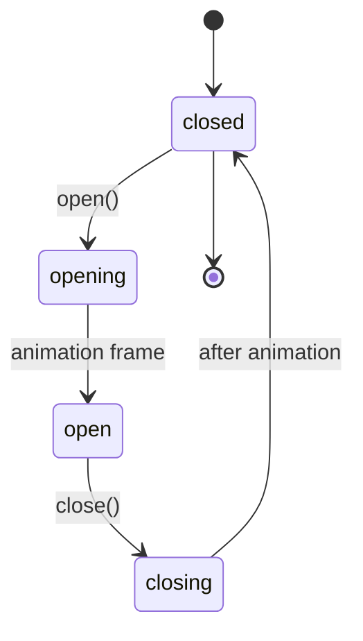

# Modal State Management

## Overview

The PModal web component uses a simple state machine pattern with `ExtendedStates` from `ComponentStates.js` to manage modal lifecycle transitions.

## State Machine



## States

The modal uses the `data-modal` attribute to expose its current state:

### `closed` (ExtendedStates.CLOSED)
- **Initial state** - Modal is not visible
- **Transitions to**: `opening` via `open()` method

### `opening` (ExtendedStates.OPENING)
- **Transition state** - Modal is becoming visible
- **Duration**: One animation frame
- **Transitions to**: `open` automatically

### `open` (ExtendedStates.OPEN)
- **Active state** - Modal is fully visible and interactive
- **Transitions to**: `closing` via `close()` method

### `closing` (ExtendedStates.CLOSING)
- **Transition state** - Modal is becoming hidden
- **Duration**: Controlled by `--modal-animation-duration` CSS variable (default: 0.2s)
- **Transitions to**: `closed` automatically

## Implementation

### Importing States

```javascript
import { ExtendedStates } from '../core/ComponentStates.js';
```

### Open Method

```javascript
open() {
  /* Set opening state */
  this.setAttribute('data-modal', ExtendedStates.OPENING);
  this.setAttribute('open', '');

  /* Transition to fully open after animation starts */
  requestAnimationFrame(() => {
    this.setAttribute('data-modal', ExtendedStates.OPEN);
  });
}
```

### Close Method

```javascript
close() {
  /* Set closing state */
  this.setAttribute('data-modal', ExtendedStates.CLOSING);

  /* Wait for closing animation before removing open attribute */
  const duration =
    parseFloat(getComputedStyle(this).getPropertyValue('--modal-animation-duration') || '0.2') *
    1000;

  setTimeout(() => {
    this.removeAttribute('open');
    this.setAttribute('data-modal', ExtendedStates.CLOSED);
  }, duration);
}
```

### Initialization

```javascript
constructor() {
  super();
  // ... setup code ...

  // Initialize with closed state
  this.setAttribute('data-modal', ExtendedStates.CLOSED);
}
```

## CSS Integration

Since PModal is a web component with Shadow DOM, internal styles use the `:host([open])` selector for display. The `data-modal` attribute is primarily for:

1. **State debugging** - Inspect current modal state in DevTools
2. **External styling** - Target specific states from outside Shadow DOM if needed
3. **State tracking** - Monitor modal lifecycle for analytics or testing

Example external CSS targeting (if needed):

```css
/* Target modals in opening state */
p-modal[data-modal="opening"] {
  /* Optional external styling */
}

/* Target modals in closing state */
p-modal[data-modal="closing"] {
  /* Optional external styling */
}
```

## Events

The modal dispatches events at key lifecycle points:

- `modal:open` - Fired when modal opens (during `_onOpen()`)
- `modal:close` - Fired when modal closes (during `_onClose()`)

State changes do not trigger separate events; use the existing lifecycle events instead.

## Usage Example

```html
<p-modal id="example-modal"
         data-modal-closable="true"
         data-modal-backdrop-close="true">
  <h2 slot="title">Example Modal</h2>
  <p>Modal content goes here.</p>
  <div slot="actions">
    <button class="btn btn--secondary" data-modal-close>Cancel</button>
    <button class="btn btn--primary">Confirm</button>
  </div>
</p-modal>

<button data-modal data-modal-target="#example-modal">
  Open Modal
</button>
```

### JavaScript API

```javascript
const modal = document.querySelector('#example-modal');

// Open modal
modal.open();
// data-modal="opening" → data-modal="open"

// Close modal
modal.close();
// data-modal="closing" → data-modal="closed"

// Toggle modal
modal.toggle();

// Check current state
console.log(modal.getAttribute('data-modal')); // "open", "closed", etc.
```

## Benefits

### Code Simplicity
- Uses existing `ExtendedStates` constants
- No custom state validation logic needed
- Minimal code addition (~15 lines)

### Consistency
- Matches framework-wide state management pattern
- Same state values as other components (Lightbox, Toggle, etc.)
- Predictable state transitions

### Debugging
- State visible in DevTools as `data-modal` attribute
- Easy to verify current modal state
- Helpful for testing and troubleshooting

## Configuration

### Animation Duration

Control transition timing via CSS variable:

```css
p-modal {
  --modal-animation-duration: 0.3s; /* Override default 0.2s */
}
```

The `close()` method reads this value to ensure the `closing` state duration matches the CSS animation.

## Related Documentation

- [ComponentStates.js](/src/core/ComponentStates.js) - Standard state values
- [Lightbox State Management](/docs/guides/lightbox-state-management.md) - Similar pattern
- [Creating Components](/docs/guides/creating-components.md) - Component architecture

## Best Practices

1. **Don't manipulate state directly** - Use `open()` and `close()` methods
2. **Don't skip states** - Let the state machine handle transitions
3. **Use CSS variables** - Configure animation timing via CSS, not JavaScript
4. **Listen to events** - Use `modal:open` and `modal:close` for lifecycle hooks
5. **Check state when needed** - Read `data-modal` attribute for current state

## Migration Notes

### From Previous Version

No migration needed - this is a non-breaking addition. The modal continues to work exactly as before, with state management added as an enhancement for debugging and consistency.

### State Values

All state values are lowercase strings matching `ExtendedStates`:
- `"closed"` (not `"CLOSED"`)
- `"opening"` (not `"OPENING"`)
- `"open"` (not `"OPEN"`)
- `"closing"` (not `"CLOSING"`)

This matches the HTML attribute convention and ComponentStates implementation.
