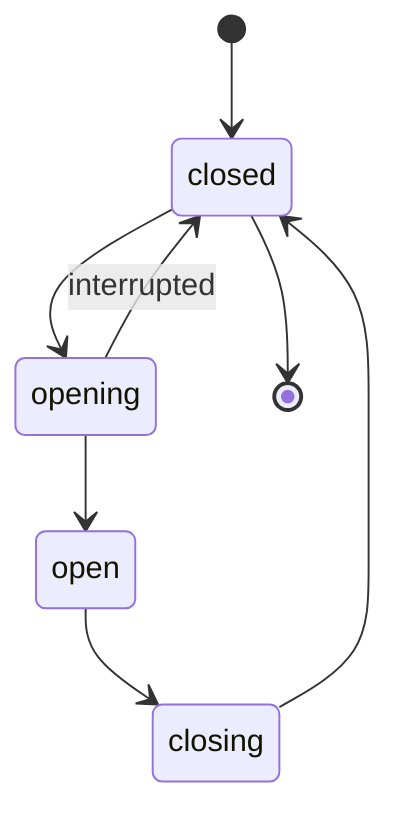

# State Management System Completion Plan

**Status**: 3 of 7 Phases Complete (43%)
**Priority**: High
**Last Updated**: 2025-11-19
**Next Session**: Resume with Phase 4 (Toggle State-Based CSS)

---

## Progress Summary

### ✅ Completed Phases (3/7)

- **Phase 1**: Modal State Machine - COMPLETE (2025-11-19)
- **Phase 2**: Tabs State-Based CSS - COMPLETE (2025-11-19)
- **Phase 3**: DataTable Async States - COMPLETE (2025-11-19)

### 📋 Remaining Phases (4/7)

- **Phase 4**: Toggle State-Based CSS Enhancement
- **Phase 5**: Lightbox CSS Implementation
- **Phase 6**: Documentation & State Diagrams
- **Phase 7**: State Debugger Tool (Optional)

---

## Executive Summary

The Parallelogram-JS framework has a robust state management foundation in `BaseComponent` using WeakMap-based per-element state storage, plus a centralized `ComponentStates.js` library that defines standard state values (OPEN, CLOSED, OPENING, CLOSING, LOADING, etc.).

**Progress**: We have successfully completed state management implementation for 3 components (Modal, Tabs, DataTable), with comprehensive documentation for each. The remaining work focuses on Toggle, Lightbox CSS implementation, and optional documentation/tooling enhancements.

---

## Current State Analysis

### ✅ Components with Complete State Management (11)

1. **Lightbox** - Full state machine with documentation
2. **Toggle** - Multi-trigger state synchronization (needs CSS enhancement)
3. **Lazysrc** - Promise-aware state handling
4. **Scrollreveal** - Queue-based state management
5. **Videoplay** - Visibility state tracking
6. **Scrollhide** - Scroll position state
7. **SelectLoader** - Loading state with validation
8. **Toast** - Configuration state management
9. **PModal** - ✅ NEW: State machine (closed → opening → open → closing)
10. **Tabs** - ✅ NEW: State-based CSS (panel states: active/inactive/transitioning)
11. **DataTable** - ✅ NEW: Async states (loading/error/empty with visual feedback)

### ⚠️ Components Needing Enhancement (2)

1. **Toggle** - Has state, needs state-based CSS instead of classes
2. **FormEnhancer** - Has validation state, needs state-based CSS

---

## ✅ Phase 1: Modal State Machine Implementation [COMPLETE]

**Completed**: 2025-11-19
**Actual Effort**: ~2 hours
**Status**: ✅ COMPLETE
**Files Changed**:
- `src/components/PModal.js` - Added ExtendedStates import and state transitions
- `docs/guides/modal-state-management.md` - Created comprehensive documentation
- Demo rebuilt successfully

**Implementation Summary**:
- ✅ Added state machine using ExtendedStates: CLOSED → OPENING → OPEN → CLOSING → CLOSED
- ✅ State exposed via `data-modal` attribute on PModal web component
- ✅ Animation duration configurable via `--modal-animation-duration` CSS variable
- ✅ Documentation includes state diagram, usage examples, and best practices
- ✅ ~15 lines of code added following framework efficiency principles

**Success Criteria Met**:
- ✅ State machine prevents invalid transitions
- ✅ State attribute updates on transitions
- ✅ Events fire for all state transitions (modal:open, modal:close)
- ✅ Documentation includes Mermaid state diagram
- ✅ Demo shows smooth transitions

---

## ✅ Phase 2: Tabs State-Based CSS [COMPLETE]

**Completed**: 2025-11-19
**Actual Effort**: ~2 hours
**Status**: ✅ COMPLETE
**Files Changed**:
- `src/components/Tabs.js` - Added ComponentStates import and panel state management
- `src/styles/framework/components/tabs.scss` - Added state-based CSS selectors
- `docs/guides/tabs-state-management.md` - Created comprehensive documentation
- Demo rebuilt successfully

**Implementation Summary**:
- ✅ Panel states using data attributes: active, inactive, transitioning
- ✅ Tab buttons use ARIA attributes (aria-selected, tabindex) - no custom state
- ✅ SCSS updated with `[data-tab-panel="state"]` selectors
- ✅ Removed class-based approach (tab--active, tab-panel--active removed)
- ✅ Documentation includes state diagram and migration notes
- ✅ ~20 lines of code modified

**Success Criteria Met**:
- ✅ Smooth transitions between tabs
- ✅ No layout shift during transitions
- ✅ State prevents concurrent tab changes
- ✅ Customizable transition duration via `Tabs.defaults.transitionDuration`
- ✅ Documentation with examples and ARIA best practices

---

## ✅ Phase 3: DataTable Async States [COMPLETE]

**Completed**: 2025-11-19
**Actual Effort**: ~2 hours
**Status**: ✅ COMPLETE
**Files Changed**:
- `src/components/DataTable.js` - Added ComponentStates, ExtendedStates, and loadData() method
- `src/styles/framework/components/datatable.scss` - Added state-based CSS with loading spinner
- `docs/guides/datatable-state-management.md` - Created comprehensive documentation
- Demo rebuilt successfully

**Implementation Summary**:
- ✅ States: mounted, loading, loaded, error, empty
- ✅ New `loadData(element, url, rowMapper)` method for async data fetching
- ✅ New `clearError(element)` method to reset error state
- ✅ Loading spinner using CSS ::after pseudo-element with animated SVG
- ✅ Error messages displayed via `data-error-message` attribute and CSS ::before
- ✅ Events: datatable:loaded, datatable:error, datatable:empty
- ✅ Documentation includes async usage examples and API reference
- ✅ ~100 lines of code added

**Success Criteria Met**:
- ✅ Loading indicator shows during async operations (animated spinner)
- ✅ Error messages display clearly with data-error-message attribute
- ✅ Empty state shows "No data available" message
- ✅ All states have appropriate CSS styling with visual feedback
- ✅ Documentation includes async examples and error recovery patterns

---

## ⏸️ PHASES 4-7 PENDING

The following phases are planned but not yet started. Resume with Phase 4 when continuing work.

---

## 📋 Phase 4: Toggle State-Based CSS Enhancement [PENDING]

**Estimated Effort**: 2-3 hours
**Priority**: Low-Medium
**Dependencies**: None
**Status**: ⏸️ PENDING - Resume here

### Original Plan (Preserved for Reference)

### Current State
- File: `src/components/Toggle.js`
- Uses: Full state management already implemented
- CSS: Basic utility classes only
- Missing: Transition classes for open/close animations

### Required Changes

#### 4.1 Add Animation States Using ComponentStates (30 min - 1 hour)
```javascript
// Import standard states from ComponentStates
import { ExtendedStates } from '../core/ComponentStates.js';

// State transitions: closed → opening → open → closing → closed
// Use ExtendedStates: CLOSED, OPENING, OPEN, CLOSING

open() {
  // Set opening state
  this.setAttribute('data-modal', ExtendedStates.OPENING);
  this.setAttribute('open', '');

  // Transition to fully open after animation starts
  requestAnimationFrame(() => {
    this.setAttribute('data-modal', ExtendedStates.OPEN);
  });
}

close() {
  // Set closing state
  this.setAttribute('data-modal', ExtendedStates.CLOSING);

  // Wait for animation before removing open attribute
  const duration = parseFloat(
    getComputedStyle(this).getPropertyValue('--modal-animation-duration') || '0.2'
  ) * 1000;

  setTimeout(() => {
    this.removeAttribute('open');
    this.setAttribute('data-modal', ExtendedStates.CLOSED);
  }, duration);
}
```

**Key Points:**
- Use existing `ExtendedStates.OPEN`, `CLOSED`, `OPENING`, `CLOSING` from ComponentStates.js
- No custom state machine needed - keep it simple
- Let CSS handle visual states via `[data-modal="open"]` attribute selectors

#### 1.2 Update CSS (1 hour)
- File: `src/styles/framework/components/modal.scss` (NEW - needs creation)
- Add state-based attribute selectors:
  ```scss
  /* State-based styling using data-modal attribute */
  [data-modal="closed"] {
    display: none;
    opacity: 0;
  }

  [data-modal="opening"] {
    display: block;
    opacity: 0;
    animation: fadeIn var(--transition-normal) forwards;
  }

  [data-modal="open"] {
    display: block;
    opacity: 1;
  }

  [data-modal="closing"] {
    display: block;
    opacity: 1;
    animation: fadeOut var(--transition-normal) forwards;
  }
  ```

#### 1.3 Add Documentation (1-2 hours)
- Create: `docs/guides/modal-state-management.md`
- Document: State diagram, transitions, CSS classes, events
- Pattern: Follow `lightbox-state-management.md` structure

### Success Criteria
- [ ] State machine prevents invalid transitions
- [ ] CSS classes update on state changes
- [ ] Events fire for all state transitions
- [ ] Documentation includes state diagram
- [ ] Demo shows smooth transitions

---

## Phase 2: Tabs State-Based CSS

**Estimated Effort**: 3-4 hours
**Priority**: Medium-High
**Dependencies**: None

### Current State
- File: `src/components/Tabs.js`
- Uses: `getState()` with `tabs`, `panels`, `activeTab`, `activePanel`
- CSS: Uses `aria-selected` attribute selectors only
- Missing: Transition classes for tab switching animations

### Required Changes

#### 2.1 Enhance State Management Using ComponentStates (1 hour)
```javascript
import { ComponentStates } from '../core/ComponentStates.js';

async _activateTab(targetTab, targetPanel, state) {
  const currentState = state.element.getAttribute('data-tabs');
  if (currentState === ComponentStates.PROCESSING) return;

  // Set processing state (tabs are transitioning)
  state.element.setAttribute('data-tabs', ComponentStates.PROCESSING);

  // Set panel states using data attributes
  state.activePanel?.setAttribute('data-tabs-panel', 'hiding');
  targetPanel.setAttribute('data-tabs-panel', 'showing');

  // Wait for transition
  await this._waitForTransition(targetPanel);

  // Update to final states
  state.activePanel?.setAttribute('data-tabs-panel', 'inactive');
  targetPanel.setAttribute('data-tabs-panel', 'active');

  state.activeTab = targetTab;
  state.activePanel = targetPanel;
  state.element.setAttribute('data-tabs', ComponentStates.MOUNTED);
}
```

**Key Points:**
- Use `ComponentStates.PROCESSING` for transitioning state
- Use `ComponentStates.MOUNTED` for idle/ready state
- Panel states can use custom values (hiding/showing/active/inactive) as they're sub-states

#### 2.2 Add State-Based CSS (1 hour)
- File: `src/styles/framework/components/tabs.scss`
- Add state-based attribute selectors:
  ```scss
  /* Panel state transitions */
  [data-tabs-panel="hiding"] {
    opacity: 0;
    transition: opacity var(--transition-normal);
  }

  [data-tabs-panel="showing"] {
    opacity: 0;
    animation: fadeIn var(--transition-normal) forwards;
  }

  [data-tabs-panel="active"] {
    opacity: 1;
  }

  [data-tabs-panel="inactive"] {
    display: none;
  }
  ```

#### 2.3 Documentation (1 hour)
- Create: `docs/guides/tabs-state-management.md`
- Document: Transition states, CSS classes, animation options

### Success Criteria
- [ ] Smooth transitions between tabs
- [ ] No layout shift during transitions
- [ ] State prevents concurrent tab changes
- [ ] Customizable transition duration via CSS variables
- [ ] Documentation with examples

---

## Phase 3: DataTable Loading/Error States

**Estimated Effort**: 4-5 hours
**Priority**: Medium
**Dependencies**: None

### Current State
- File: `src/components/DataTable.js`
- Uses: Comprehensive state with sorting, filtering, pagination
- Missing: Loading state for async operations, error state handling
- No CSS: for loading indicators or error messages

### Required Changes

#### 3.1 Add Async State Management Using ComponentStates (1-2 hours)
```javascript
import { ComponentStates, ExtendedStates } from '../core/ComponentStates.js';

async _loadData(element, state, url) {
  try {
    // Set loading state using ExtendedStates
    element.setAttribute('data-datatable', ExtendedStates.LOADING);

    const response = await fetch(url);
    if (!response.ok) throw new Error(`HTTP ${response.status}`);

    const data = await response.json();

    if (data.length === 0) {
      // Use custom 'empty' state (could add to ExtendedStates)
      element.setAttribute('data-datatable', 'empty');
    } else {
      // Use LOADED state from ExtendedStates
      element.setAttribute('data-datatable', ExtendedStates.LOADED);
      state.originalRows = data;
      this._renderTable(element, state);
    }
  } catch (error) {
    // Use ERROR state from ComponentStates
    element.setAttribute('data-datatable', ComponentStates.ERROR);
    state.errorMessage = error.message;
    this._dispatch(element, 'datatable:error', { error });
  }
}
```

**Key Points:**
- Use `ExtendedStates.LOADING` for async operations
- Use `ExtendedStates.LOADED` when complete
- Use `ComponentStates.ERROR` for errors
- Custom states like 'empty' can be added if needed frequently

#### 3.2 Add State-Based CSS (1-2 hours)
- File: `src/styles/framework/components/datatable.scss`
- Add state-based attribute selectors:
  ```scss
  /* DataTable state-based styling */
  [data-datatable="loading"] {
    pointer-events: none;
    position: relative;

    &::after {
      content: '';
      position: absolute;
      inset: 0;
      background: rgba(255, 255, 255, 0.8);
      display: flex;
      align-items: center;
      justify-content: center;
      /* Add spinner animation */
    }
  }

  [data-datatable="error"] {
    border: 2px solid var(--brand-danger, #ef4444);
  }

  [data-datatable="empty"] {
    /* Empty state styling */
  }

  [data-datatable="idle"] {
    /* Normal state */
  }
  ```

#### 3.3 Documentation (1 hour)
- Create: `docs/guides/datatable-state-management.md`
- Document: Loading states, error handling, empty states

### Success Criteria
- [ ] Loading indicator shows during async operations
- [ ] Error messages display clearly with retry option
- [ ] Empty state shows when no data available
- [ ] All states have appropriate CSS styling
- [ ] Documentation includes async examples

---

## Phase 4: Toggle State-Based CSS Enhancement

**Estimated Effort**: 2-3 hours
**Priority**: Low-Medium
**Dependencies**: None

### Current State
- File: `src/components/Toggle.js`
- Uses: Full state management already implemented
- CSS: Basic utility classes only
- Missing: Transition classes for open/close animations

### Required Changes

#### 4.1 Add Animation States Using ComponentStates (30 min - 1 hour)
```javascript
import { ExtendedStates } from '../core/ComponentStates.js';

async _toggle(trigger, state) {
  const target = state.target;
  const currentState = target.getAttribute('data-toggle-target');

  // Prevent toggling during transitions
  if (currentState === ExtendedStates.OPENING || currentState === ExtendedStates.CLOSING) {
    return;
  }

  if (currentState === ExtendedStates.OPEN) {
    target.setAttribute('data-toggle-target', ExtendedStates.CLOSING);
    await this._waitForTransition(target);
    target.setAttribute('data-toggle-target', ExtendedStates.CLOSED);
    state.isOpen = false;
  } else {
    target.setAttribute('data-toggle-target', ExtendedStates.OPENING);
    await this._waitForTransition(target);
    target.setAttribute('data-toggle-target', ExtendedStates.OPEN);
    state.isOpen = true;
  }
}
```

**Key Points:**
- Use `ExtendedStates.OPEN`, `CLOSED`, `OPENING`, `CLOSING`
- No custom state machine needed
- Simple and consistent with rest of framework

#### 4.2 Add State-Based CSS (1 hour)
- File: `src/styles/framework/components/toggle.scss`
- Add state-based attribute selectors:
  ```scss
  /* Toggle target states */
  [data-toggle-target="closed"] {
    display: none;
  }

  [data-toggle-target="opening"] {
    display: block;
    animation: slideDown var(--transition-normal) ease-out;
  }

  [data-toggle-target="open"] {
    display: block;
  }

  [data-toggle-target="closing"] {
    display: block;
    animation: slideUp var(--transition-normal) ease-in;
    pointer-events: none;
  }
  ```

#### 4.3 Documentation Update (30 min - 1 hour)
- Update: `docs/guides/toggle-state-management.md` (create)
- Document: Animation states, CSS customization

### Success Criteria
- [ ] Smooth open/close animations
- [ ] Prevents concurrent toggle operations
- [ ] Customizable animation via CSS variables
- [ ] Documentation with animation examples

---

## Phase 5: Lightbox CSS Implementation

**Estimated Effort**: 2-3 hours
**Priority**: Medium
**Dependencies**: None

### Current State
- File: `src/components/Lightbox.js`
- State: Complete state machine implemented
- Documentation: Full state management guide exists
- CSS: Uses `.show` utility class instead of state-based classes
- Missing: Implementation of `.is-*` classes documented in guide

### Required Changes

#### 5.1 Update Component to Use ComponentStates (1 hour)
- File: `src/components/Lightbox.js`
- Replace class-based state with data attribute state using ExtendedStates
- Simplify `_setState()` method:
  ```javascript
  import { ExtendedStates } from '../core/ComponentStates.js';

  _setState(element, newState) {
    const state = this.getState(element);
    const oldState = this.lightboxElement?.getAttribute('data-lightbox') || ExtendedStates.CLOSED;

    // Simply set the state - no complex validation needed
    state.lightboxState = newState;
    this.lightboxElement?.setAttribute('data-lightbox', newState);

    this._dispatch(element, 'lightbox:state-change', { oldState, newState });
  }

  // Use ExtendedStates constants
  _open(triggerElement) {
    this._setState(triggerElement, ExtendedStates.OPENING);
    // ... setup code ...
    requestAnimationFrame(() => {
      this._setState(triggerElement, ExtendedStates.OPEN);
    });
  }

  _close(triggerElement) {
    this._setState(triggerElement, ExtendedStates.CLOSING);
    // ... cleanup code ...
    setTimeout(() => {
      this._setState(triggerElement, ExtendedStates.CLOSED);
    }, duration);
  }
  ```

#### 5.2 Update SCSS (1 hour)
- File: `src/styles/framework/components/lightbox.scss`
- Replace class-based selectors with attribute selectors using standard state values:
  ```scss
  /* Lightbox state-based styling using ComponentStates values */
  [data-lightbox="closed"] {
    display: none;
    opacity: 0;
  }

  [data-lightbox="opening"] {
    display: flex;
    opacity: 0;
    animation: lightboxFadeIn var(--transition-normal) forwards;
  }

  [data-lightbox="open"] {
    display: flex;
    opacity: 1;
  }

  [data-lightbox="closing"] {
    display: flex;
    opacity: 1;
    animation: lightboxFadeOut var(--transition-normal) forwards;
  }

  @keyframes lightboxFadeIn {
    from { opacity: 0; transform: scale(0.95); }
    to { opacity: 1; transform: scale(1); }
  }

  @keyframes lightboxFadeOut {
    from { opacity: 1; transform: scale(1); }
    to { opacity: 0; transform: scale(0.95); }
  }
  ```

**Note:** State values match ExtendedStates: "closed", "opening", "open", "closing"

#### 5.3 Test & Verify (30 min)
- Test all state transitions
- Verify animations work smoothly
- Check keyboard navigation during transitions

### Success Criteria
- [ ] All state classes match documentation
- [ ] Smooth animations between states
- [ ] No `.show` utility class references remain
- [ ] State-based CSS matches state machine behavior

---

## Phase 6: Documentation & State Diagrams

**Estimated Effort**: 4-6 hours
**Priority**: Medium
**Dependencies**: Phases 1-4 complete

### Required Deliverables

#### 6.1 Component State Guides (3-4 hours)
Create comprehensive state management guides for each component:

1. **Modal State Management** (`docs/guides/modal-state-management.md`)
   - State diagram: closed → opening → open → closing → closed
   - Event lifecycle
   - CSS class reference
   - Example usage

2. **Tabs State Management** (`docs/guides/tabs-state-management.md`)
   - Transition states
   - Animation timing
   - Accessibility considerations
   - Example implementations

3. **DataTable State Management** (`docs/guides/datatable-state-management.md`)
   - Async state handling
   - Loading indicators
   - Error recovery patterns
   - Empty state handling

4. **Toggle State Management** (`docs/guides/toggle-state-management.md`)
   - Animation states
   - Multi-trigger synchronization
   - CSS customization
   - Accessibility

#### 6.2 Master State Management Guide (2 hours)
Create: `docs/guides/state-management-overview.md`

Content:
- BaseComponent state architecture
- WeakMap benefits and usage
- State machine patterns (following Lightbox example)
- Best practices for component state
- Common pitfalls to avoid
- Performance considerations
- Memory management (cleanup patterns)

#### 6.3 Visual State Diagrams (1-2 hours)
- Create Mermaid diagrams for each component
- Include in documentation
- Show valid state transitions
- Document invalid transitions

Example:


### Success Criteria
- [ ] All components have state management documentation
- [ ] Master guide explains state architecture
- [ ] Visual diagrams for all state machines
- [ ] Code examples for common patterns
- [ ] Troubleshooting section in guides

---

## Phase 7: State Debugger Tool (Optional)

**Estimated Effort**: 8-12 hours
**Priority**: Low
**Dependencies**: Phases 1-6 complete

### Overview
Create a dev-mode overlay that shows real-time component states for debugging.

### Features
1. **State Inspector Panel**
   - List all mounted components
   - Show current state for each
   - Highlight state changes in real-time

2. **State History**
   - Timeline of state transitions
   - Filter by component type
   - Export state logs

3. **State Manipulation**
   - Manually trigger state changes
   - Test edge cases
   - Validate transition rules

### Implementation
- Add to debug mode in Parallelogram core
- Use EventManager to track state changes
- Overlay UI using CSS Grid/Flexbox
- Keyboard shortcut to toggle (e.g., Ctrl+Shift+S)

### Success Criteria
- [ ] Shows all component states in real-time
- [ ] Easy to toggle on/off
- [ ] Minimal performance impact
- [ ] Export functionality for bug reports
- [ ] Documentation on usage

---

## Implementation Timeline

### Week 1: Core Components
- **Day 1-2**: Phase 1 - Modal State Machine (4-6 hours)
- **Day 3**: Phase 2 - Tabs State-Based CSS (3-4 hours)
- **Day 4-5**: Phase 3 - DataTable Async States (4-5 hours)

### Week 2: Enhancement & Documentation
- **Day 1**: Phase 4 - Toggle CSS Enhancement (2-3 hours)
- **Day 2**: Phase 5 - Lightbox CSS Implementation (2-3 hours)
- **Day 3-5**: Phase 6 - Documentation & Diagrams (4-6 hours)

### Week 3+: Optional
- Phase 7 - State Debugger Tool (8-12 hours, can be postponed)

**Total Estimated Effort**: 19-27 hours (excluding Phase 7)

---

## Testing Strategy

### Unit Tests
For each component state machine:
- Test valid state transitions
- Test invalid transition prevention
- Test state event emissions
- Test CSS class application

### Integration Tests
- Multi-component state interactions
- Nested modal states
- Tab switching during transitions
- DataTable state with pagination

### Visual Regression Tests
- Screenshot each state
- Compare before/after CSS changes
- Verify animations complete correctly

### Manual Testing Checklist
- [ ] All state transitions work smoothly
- [ ] No console errors/warnings
- [ ] Animations respect user preferences (prefers-reduced-motion)
- [ ] Keyboard navigation works in all states
- [ ] Screen reader announces state changes
- [ ] Memory doesn't leak (state cleanup works)

---

## Success Metrics

### Code Quality
- [ ] All components use BaseComponent state management consistently
- [ ] No direct DOM manipulation of state-related classes outside state machine
- [ ] State transitions use event system for communication
- [ ] All state changes logged in debug mode

### Documentation Quality
- [ ] Each component has state management guide
- [ ] Master guide explains state architecture
- [ ] Visual diagrams for all state machines
- [ ] Code examples test successfully

### Performance
- [ ] State transitions complete in < 300ms
- [ ] No memory leaks after 100 mount/unmount cycles
- [ ] State updates don't block main thread
- [ ] Animations at 60fps on mid-range devices

### Accessibility
- [ ] State changes announced to screen readers
- [ ] Keyboard navigation works during transitions
- [ ] Focus management respects state changes
- [ ] prefers-reduced-motion disables animations

---

## Risk Assessment

### Low Risk
- ✅ BaseComponent provides solid foundation
- ✅ Lightbox pattern proven successful
- ✅ No breaking changes to public API

### Medium Risk
- ⚠️ Modal delegates to PModal web component - may need coordination
- ⚠️ Existing demos may need updates for new CSS classes
- ⚠️ Animation timing could conflict with user CSS

### Mitigation Strategies
1. **PModal Integration**: Test thoroughly, ensure state sync between wrapper and web component
2. **Demo Updates**: Include demo updates in each phase
3. **CSS Conflicts**: Use scoped CSS variables, provide override documentation
4. **Breaking Changes**: Add deprecation warnings before removing old classes

---

## Open Questions

1. **Modal/PModal Coordination**: How should Modal component state sync with PModal web component state?
   - **Proposed**: Modal component listens to PModal events and updates its state accordingly

2. **Animation Preferences**: Should we provide multiple animation presets (fade, slide, scale)?
   - **Proposed**: Start with fade, add others as CSS modifier classes

3. **State Persistence**: Should component states persist across page navigations?
   - **Proposed**: No by default, provide opt-in localStorage integration

4. **Backwards Compatibility**: Should we maintain `.show` class alongside state classes?
   - **Proposed**: Yes initially with deprecation warning, remove in v1.0

---

## Next Steps

1. **Immediate**: Review this plan with stakeholders
2. **Day 1**: Begin Phase 1 (Modal State Machine)
3. **After Phase 1**: Get feedback on approach before continuing
4. **Weekly**: Review progress against timeline
5. **After Phase 6**: Decide if Phase 7 (debugger) is needed

---

## References

- **Existing Documentation**:
  - `docs/guides/lightbox-state-management.md` - State machine pattern reference
  - `docs/guides/creating-components.md` - Component creation guide
  - `docs/guides/coding-standards.md` - Code style reference

- **Related Components**:
  - `src/core/BaseComponent.js` - State management foundation
  - `src/components/Lightbox.js` - Complete state machine example
  - `src/components/Toggle.js` - Multi-trigger state sync example

- **Testing Resources**:
  - `test/TEST-CHECKLIST.md` - Testing procedures

---

**Document Owner**: Development Team
**Review Cycle**: After each phase completion
**Last Major Revision**: 2025-11-19