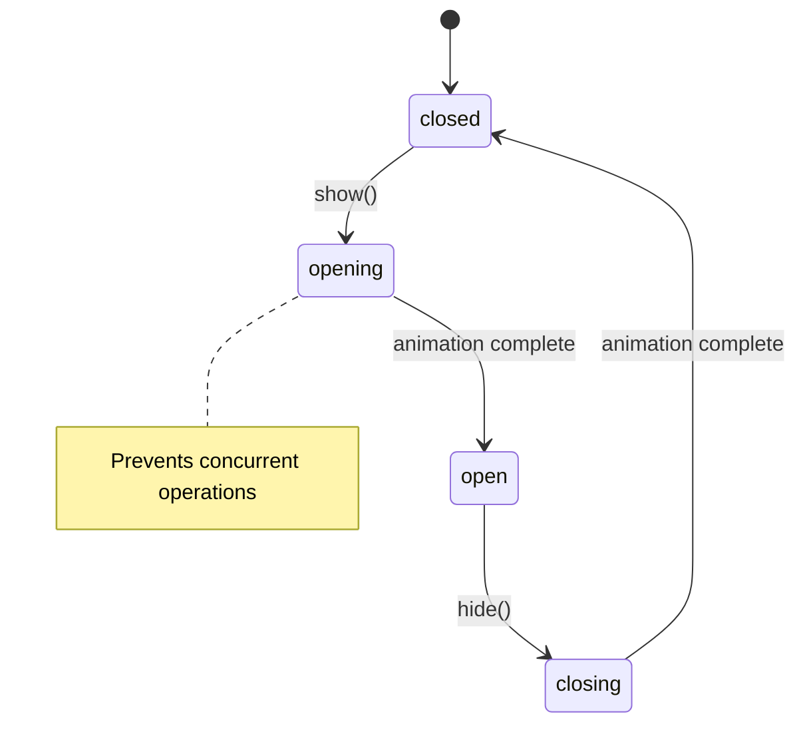
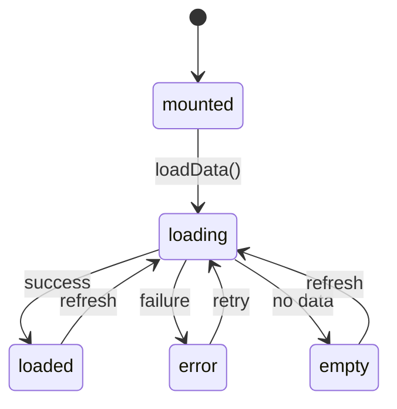

# State Management Overview - Parallelogram-JS

**Status**: ✅ Complete
**Last Updated**: 2025-11-19
**Version**: 1.0.0

---

## Table of Contents

1. [Introduction](#introduction)
2. [Architecture](#architecture)
3. [State Management Patterns](#state-management-patterns)
4. [Component State Lifecycle](#component-state-lifecycle)
5. [Best Practices](#best-practices)
6. [Common Pitfalls](#common-pitfalls)
7. [Performance Considerations](#performance-considerations)
8. [Debugging State](#debugging-state)
9. [Component-Specific Guides](#component-specific-guides)

---

## Introduction

Parallelogram-JS uses a robust, WeakMap-based state management system that provides:

- **Per-element state tracking** - Each DOM element maintains its own state
- **Memory-safe cleanup** - Automatic garbage collection via WeakMap
- **Consistent API** - All components follow the same patterns
- **Visual state representation** - Data attributes expose state to CSS
- **Type-safe state values** - Centralized state constants

### Core Principles

1. **Progressive Enhancement** - Components enhance existing HTML
2. **State-Based CSS** - Visual states controlled via data attributes
3. **Event-Driven** - State changes emit events for coordination
4. **Memory Efficient** - WeakMap enables automatic cleanup
5. **Developer-Friendly** - Clear API with automatic component name handling

---

## Architecture

### BaseComponent Foundation

All components extend `BaseComponent`, which provides the state management infrastructure:

```javascript
import { BaseComponent } from '@parallelogram-js/core';

class MyComponent extends BaseComponent {
  _init(element) {
    const state = super._init(element); // Returns { cleanup, controller }

    // Add component-specific state
    state.myValue = 'initial';
    state.isActive = false;

    return state;
  }
}
```

**Key Features:**

- **WeakMap Storage**: `this.elements` stores state per element
- **AbortController**: Automatic event cleanup on unmount
- **Lifecycle Methods**: `mount()`, `update()`, `unmount()`, `destroy()`
- **Helper Methods**: `getState()`, `setState()`, `getAttr()`, `setAttr()`

### Component States (ComponentStates.js)

Centralized state constants ensure consistency:

```javascript
import { ComponentStates, ExtendedStates } from '@parallelogram-js/core';

// Basic States
Component States.MOUNTED = 'mounted';
ComponentStates.ERROR = 'error';
ComponentStates.PROCESSING = 'processing';

// Extended States (for animations/transitions)
ExtendedStates.CLOSED = 'closed';
ExtendedStates.OPENING = 'opening';
ExtendedStates.OPEN = 'open';
ExtendedStates.CLOSING = 'closing';
ExtendedStates.LOADING = 'loading';
ExtendedStates.LOADED = 'loaded';
```

---

## State Management Patterns

### Pattern 1: Simple State Machine

**Use for:** Components with clear open/close or show/hide states

**Example:** Toggle, Modal, Lightbox

```javascript
import { ExtendedStates } from '../core/ComponentStates.js';

class Toggle extends BaseComponent {
  show(element) {
    const state = this.getState(element);

    // Check current state
    const currentState = this.getAttr(state.target, 'target');
    if (currentState === ExtendedStates.OPENING ||
        currentState === ExtendedStates.OPEN) {
      return; // Already opening or open
    }

    // Set opening state
    this.setAttr(state.target, 'target', ExtendedStates.OPENING);

    // Transition to open after animation
    setTimeout(() => {
      this.setAttr(state.target, 'target', ExtendedStates.OPEN);
    }, this.transitionDuration);
  }
}
```

**State Diagram:**


---

### Pattern 2: Async State Management

**Use for:** Components that load data or perform async operations

**Example:** DataTable, SelectLoader

```javascript
import { ExtendedStates, ComponentStates } from '../core/ComponentStates.js';

class DataTable extends BaseComponent {
  async loadData(element, url) {
    const state = this.getState(element);

    try {
      // Set loading state
      this.setState(element, ExtendedStates.LOADING);

      const response = await fetch(url);
      if (!response.ok) throw new Error(`HTTP ${response.status}`);

      const data = await response.json();

      if (data.length === 0) {
        this.setState(element, 'empty');
      } else {
        this.setState(element, ExtendedStates.LOADED);
        this._renderTable(element, data);
      }
    } catch (error) {
      this.setState(element, ComponentStates.ERROR);
      this.setAttr(element, 'error-message', error.message);
      this._dispatch(element, 'datatable:error', { error });
    }
  }
}
```

**State Diagram:**


---

### Pattern 3: Multi-Element State Sync

**Use for:** Components with multiple triggers controlling the same target

**Example:** Toggle with multiple buttons, Tabs

```javascript
class Toggle extends BaseComponent {
  show(element) {
    const state = this.getState(element);

    // Update state for this trigger
    state.isOpen = true;

    // Sync state across all triggers for the same target
    this._syncTriggerStates(state.targetSelector, true);

    // Update ARIA for all related triggers
    this._updateRelatedTriggers(state.targetSelector, true);
  }

  _syncTriggerStates(targetSelector, isOpen) {
    const triggers = document.querySelectorAll(
      `[data-toggle-target="${targetSelector}"][data-toggle-enhanced="true"]`
    );

    triggers.forEach(trigger => {
      const triggerState = this.getState(trigger);
      if (triggerState) {
        triggerState.isOpen = isOpen;
      }
    });
  }
}
```

---

### Pattern 4: Transition State Management

**Use for:** Components with complex multi-step transitions

**Example:** Tabs with fade-in/fade-out animations

```javascript
class Tabs extends BaseComponent {
  async _activateTab(targetTab, targetPanel, state) {
    // Prevent concurrent transitions
    if (state.isTransitioning) return;
    state.isTransitioning = true;

    // Hide current panel
    if (state.activePanel) {
      this.setState(state.activePanel, 'transitioning');
      await this._waitForTransition(state.activePanel);
      this.setState(state.activePanel, 'inactive');
    }

    // Show new panel
    this.setState(targetPanel, 'transitioning');
    await this._waitForTransition(targetPanel);
    this.setState(targetPanel, 'active');

    // Update state
    state.activeTab = targetTab;
    state.activePanel = targetPanel;
    state.isTransitioning = false;
  }
}
```

---

## Component State Lifecycle

### 1. Initialization (mount)

```javascript
_init(element) {
  const state = super._init(element); // { cleanup, controller }

  // Read configuration from data attributes
  const config = this._getConfigFromAttrs(element, {
    duration: 'duration',
    autoClose: 'auto-close'
  });

  // Initialize component state
  state.config = { ...MyComponent.defaults, ...config };
  state.isActive = false;
  state.currentValue = null;

  // Set initial visual state
  this.setState(element, 'mounted');

  // Setup event listeners (auto-cleaned up via controller.signal)
  element.addEventListener('click', handler, {
    signal: state.controller.signal
  });

  return state;
}
```

### 2. State Updates

```javascript
activate(element) {
  const state = this.getState(element);
  if (!state) return;

  // Update internal state
  state.isActive = true;

  // Update visual state
  this.setState(element, 'active');

  // Emit event
  this._dispatch(element, 'mycomponent:activated', {
    timestamp: performance.now()
  });
}
```

### 3. Cleanup (unmount)

```javascript
unmount(element) {
  const state = this.getState(element);
  if (!state) return;

  try {
    // cleanup() automatically aborts all event listeners
    state.cleanup?.();
  } finally {
    // WeakMap automatically garbage collects when element is removed
    this.elements.delete(element);
  }
}
```

---

## Best Practices

### 1. Use Standard State Values

**✅ Good:**
```javascript
this.setState(element, ExtendedStates.LOADING);
this.setState(element, ComponentStates.ERROR);
```

**❌ Bad:**
```javascript
this.setState(element, 'is-loading'); // Non-standard
this.setState(element, 'errored'); // Inconsistent
```

### 2. Use Helper Methods

**✅ Good:**
```javascript
this.setState(element, 'open');
this.setAttr(element, 'duration', 300);
const value = this.getAttr(element, 'value', 'default');
```

**❌ Bad:**
```javascript
element.setAttribute('data-toggle', 'open'); // Hardcoded
element.setAttribute('data-toggle-duration', '300'); // Hardcoded
const value = element.getAttribute('data-toggle-value') || 'default';
```

### 3. Prevent Concurrent State Changes

**✅ Good:**
```javascript
show(element) {
  const currentState = this.getElementState(element);
  if (currentState === 'opening' || currentState === 'open') {
    return; // Prevent concurrent operations
  }
  // ... proceed with show
}
```

**❌ Bad:**
```javascript
show(element) {
  // No check - could cause race conditions
  this.setState(element, 'opening');
}
```

### 4. Emit Events for State Changes

**✅ Good:**
```javascript
activate(element) {
  this.setState(element, 'active');
  this._dispatch(element, 'mycomponent:activated', {
    element,
    timestamp: performance.now()
  });
}
```

**❌ Bad:**
```javascript
activate(element) {
  this.setState(element, 'active');
  // No event - other components can't react
}
```

### 5. Use AbortController for Event Cleanup

**✅ Good:**
```javascript
_init(element) {
  const state = super._init(element);

  element.addEventListener('click', handler, {
    signal: state.controller.signal // Auto-cleanup!
  });

  return state;
}
```

**❌ Bad:**
```javascript
_init(element) {
  const state = super._init(element);

  element.addEventListener('click', handler);
  // Must manually remove in cleanup!

  return state;
}
```

### 6. Store Configuration in State

**✅ Good:**
```javascript
_init(element) {
  const state = super._init(element);

  state.config = this._getConfigFromAttrs(element, {
    duration: 'duration',
    autoClose: 'auto-close'
  });

  // Access via state.config.duration
  return state;
}
```

**❌ Bad:**
```javascript
_init(element) {
  const state = super._init(element);

  // Reading attributes every time - inefficient
  const duration = this.getAttr(element, 'duration', 300);

  return state;
}
```

---

## Common Pitfalls

### Pitfall 1: Not Checking Current State

**Problem:**
```javascript
toggle(element) {
  const state = this.getState(element);
  if (state.isOpen) {
    this.hide(element); // Could interrupt closing animation!
  } else {
    this.show(element);
  }
}
```

**Solution:**
```javascript
toggle(element) {
  const currentState = this.getElementState(element);

  // Check visual state, not internal state
  if (currentState === 'opening' || currentState === 'closing') {
    return; // Prevent interruption
  }

  if (currentState === 'open') {
    this.hide(element);
  } else {
    this.show(element);
  }
}
```

### Pitfall 2: Memory Leaks from Event Listeners

**Problem:**
```javascript
_init(element) {
  const state = super._init(element);

  // Event listener never removed!
  document.addEventListener('click', () => {
    this.close(element);
  });

  return state;
}
```

**Solution:**
```javascript
_init(element) {
  const state = super._init(element);

  const clickHandler = () => this.close(element);

  document.addEventListener('click', clickHandler, {
    signal: state.controller.signal // Auto-cleanup!
  });

  return state;
}
```

### Pitfall 3: State Synchronization Issues

**Problem:**
```javascript
// Multiple triggers for same target get out of sync
show(element) {
  const state = this.getState(element);
  state.isOpen = true; // Only updates THIS trigger!
  this.setAttr(state.target, 'target', 'open');
}
```

**Solution:**
```javascript
show(element) {
  const state = this.getState(element);

  // Update this trigger
  state.isOpen = true;

  // Sync all triggers for the same target
  this._syncTriggerStates(state.targetSelector, true);

  this.setAttr(state.target, 'target', 'open');
}
```

### Pitfall 4: Forgetting to Clean Up Timers

**Problem:**
```javascript
_init(element) {
  const state = super._init(element);

  state.timer = setTimeout(() => {
    this.close(element);
  }, 5000);

  // Timer continues even after unmount!
  return state;
}
```

**Solution:**
```javascript
_init(element) {
  const state = super._init(element);

  state.timer = setTimeout(() => {
    this.close(element);
  }, 5000);

  // Add to cleanup
  const originalCleanup = state.cleanup;
  state.cleanup = () => {
    if (state.timer) clearTimeout(state.timer);
    originalCleanup();
  };

  return state;
}
```

---

## Performance Considerations

### 1. WeakMap Benefits

WeakMaps provide automatic garbage collection:

```javascript
const state = this.getState(element);
// When element is removed from DOM, state is automatically GC'd
```

**Memory Usage:**
- No memory leaks from orphaned state
- State tied to element lifecycle
- Automatic cleanup on DOM removal

### 2. State Transition Performance

**Optimize animations:**

```scss
[data-toggle-target="opening"],
[data-toggle-target="closing"] {
  /* Only apply will-change during transitions */
  will-change: opacity, transform;
}

[data-toggle-target="open"],
[data-toggle-target="closed"] {
  /* Remove will-change when static */
  will-change: auto;
}
```

### 3. Batch State Updates

**✅ Good:**
```javascript
activate(element) {
  const state = this.getState(element);

  // Batch updates
  requestAnimationFrame(() => {
    this.setState(element, 'active');
    this.setAttr(element, 'activated-at', Date.now());
    this._dispatch(element, 'activated');
  });
}
```

**❌ Bad:**
```javascript
activate(element) {
  // Each call triggers reflow
  this.setState(element, 'active');
  this.setAttr(element, 'activated-at', Date.now());
  this._dispatch(element, 'activated');
}
```

### 4. Minimize State Queries

**✅ Good:**
```javascript
_init(element) {
  const state = super._init(element);

  // Query once, store in state
  state.target = this._getTargetElement(element, 'target');

  return state;
}

show(element) {
  const state = this.getState(element);
  // Use cached target
  this.setState(state.target, 'open');
}
```

**❌ Bad:**
```javascript
show(element) {
  // Query every time - expensive!
  const target = this._getTargetElement(element, 'target');
  this.setState(target, 'open');
}
```

---

## Debugging State

### 1. Console Logging

```javascript
_init(element) {
  const state = super._init(element);

  this.logger?.info('Component initialized', {
    element,
    config: state.config
  });

  return state;
}

show(element) {
  const oldState = this.getElementState(element);
  this.setState(element, 'open');

  this.logger?.debug('State changed', {
    element,
    oldState,
    newState: 'open'
  });
}
```

### 2. Event Monitoring

```javascript
// In browser console
document.addEventListener('toggle:show', (e) => {
  console.log('Toggle shown:', e.detail);
});

document.addEventListener('toggle:hide', (e) => {
  console.log('Toggle hidden:', e.detail);
});
```

### 3. State Inspector

```javascript
// Check current state
const element = document.querySelector('[data-toggle]');
const component = pgram.components.toggle;
const state = component.getState(element);

console.log('Internal state:', state);
console.log('Visual state:', element.getAttribute('data-toggle-target'));
```

### 4. Component Status

```javascript
const status = pgram.components.toggle.getStatus();
console.log('Toggle status:', status);
// {
//   totalTriggers: 3,
//   openCount: 1,
//   captureCount: 2,
//   manualCount: 1
// }
```

---

## Component-Specific Guides

For detailed implementation guides, see:

- [Modal State Management](./modal-state-management.md) - Web Component state machine
- [Toggle State Management](./toggle-state-management.md) - Multi-trigger synchronization
- [Lightbox State Management](./lightbox-state-management.md) - Gallery navigation states
- [Tabs State Management](./tabs-state-management.md) - Panel transition states
- [DataTable State Management](./datatable-state-management.md) - Async loading/error states
- [BaseComponent API](./basecomponent-api.md) - Helper methods reference

---

## Summary

Parallelogram-JS provides a robust, production-ready state management system:

- ✅ **WeakMap-based** - Automatic memory management
- ✅ **Component-scoped** - State isolated per element
- ✅ **Event-driven** - Reactive state changes
- ✅ **Type-safe** - Centralized state constants
- ✅ **CSS-friendly** - Data attributes for visual states
- ✅ **Developer-friendly** - Clear API with automatic naming
- ✅ **Performance-optimized** - Efficient state queries and updates

Follow the patterns and best practices in this guide to build maintainable, performant components with predictable state behavior.