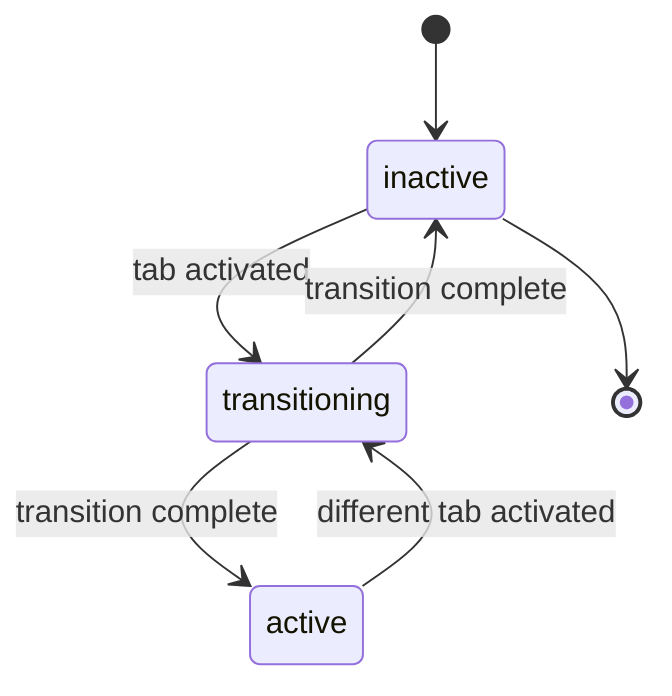

# Tabs State Management

## Overview

The Tabs component uses state-based CSS with data attributes to manage tab panel visibility and transitions. Individual tab buttons use standard ARIA attributes for accessibility.

## State Pattern

### Tab Panels

Tab panels use the `data-tab-panel` attribute to expose their current state:



## States

### Panel States

#### `inactive`
- **Default state** - Panel is hidden from view
- **CSS**: `display: none`
- **Transitions to**: `transitioning` when tab is activated

#### `transitioning`
- **Transition state** - Panel is animating in or out
- **CSS**: Opacity transition applied
- **Duration**: Controlled by `Tabs.defaults.transitionDuration` (default: 200ms)
- **Transitions to**: `active` or `inactive` after animation completes

#### `active`
- **Visible state** - Panel is displayed and visible
- **CSS**: `display: block`
- **Transitions to**: `transitioning` when different tab is activated

### Tab Button States

Tab buttons use standard ARIA attributes instead of custom state attributes:

- `aria-selected="true"` - Active tab
- `aria-selected="false"` - Inactive tab
- `tabindex="0"` - Active tab (keyboard focusable)
- `tabindex="-1"` - Inactive tabs (not in tab order)

## Implementation

### JavaScript

```javascript
import { BaseComponent } from '@parallelogram-js/core';
import { ComponentStates } from '../core/ComponentStates.js';

/* Update tab states */
state.tabs.forEach(tab => {
  const isActive = tab.dataset.tab === panelId;
  tab.setAttribute('aria-selected', isActive ? 'true' : 'false');
  tab.setAttribute('tabindex', isActive ? '0' : '-1');
});

/* Update panel states */
state.panels.forEach(panel => {
  const shouldShow = panel.id === panelId;
  panel.style.display = shouldShow ? '' : 'none';
  panel.setAttribute('data-tab-panel', shouldShow ? 'active' : 'inactive');
});
```

### Transition Logic

```javascript
async _transitionPanels(fromPanel, toPanel, state) {
  const duration = Tabs.defaults.transitionDuration;

  /* Set transitioning state */
  fromPanel.setAttribute('data-tab-panel', 'transitioning');
  toPanel.setAttribute('data-tab-panel', 'transitioning');

  /* Show target panel */
  toPanel.style.display = '';

  /* Transition out current panel */
  fromPanel.style.opacity = '0';

  /* Wait for transition */
  await new Promise(resolve => setTimeout(resolve, duration / 2));

  /* Hide previous panel */
  fromPanel.style.display = 'none';
  fromPanel.setAttribute('data-tab-panel', 'inactive');

  /* Transition in new panel */
  toPanel.style.opacity = '0';
  requestAnimationFrame(() => {
    toPanel.style.transition = `opacity ${duration}ms ease-in-out`;
    toPanel.style.opacity = '1';
  });

  /* Cleanup after transition */
  setTimeout(() => {
    toPanel.style.transition = '';
    toPanel.style.opacity = '';
    toPanel.setAttribute('data-tab-panel', 'active');
  }, duration);
}
```

### Initialization

```javascript
/* Initialize panel with inactive state */
if (!panel.getAttribute('data-tab-panel')) {
  panel.setAttribute('data-tab-panel', 'inactive');
}
```

## CSS Integration

State-based selectors target tab panels for styling:

```scss
/* State-based panel selectors */
[data-tab-panel='active'] {
  display: block;
}

[data-tab-panel='inactive'] {
  display: none;
}

[data-tab-panel='transitioning'] {
  opacity: 0;
  transition: opacity 0.2s ease-in-out;
}

/* Tab button states use ARIA attributes */
.tabs__tab {
  &[aria-selected='true'] {
    color: #0ea5e9;
    border-bottom-color: #0ea5e9;
    background: #f0f9ff;
  }
}
```

## Events

The Tabs component dispatches events at lifecycle points:

- `tabs:mount` - Fired when tabs container is initialized
- `tabs:change` - Fired when active tab changes

Events include:
```javascript
{
  element: HTMLElement,      /* Tabs container */
  activeTab: string,         /* Active panel ID */
  previousTab: string,       /* Previous panel ID */
  tab: HTMLElement,          /* Active tab button */
  panel: HTMLElement,        /* Active panel */
  timestamp: number          /* Performance timestamp */
}
```

State changes are implicit through the tab change events.

## Usage Example

### HTML

```html
<div data-tabs data-tabs-keyboard="true">
  <div data-tabs-list role="tablist" class="tabs__list">
    <button data-tab="panel-1"
            aria-selected="true"
            class="tabs__tab">
      Tab 1
    </button>
    <button data-tab="panel-2"
            aria-selected="false"
            class="tabs__tab">
      Tab 2
    </button>
    <button data-tab="panel-3"
            aria-selected="false"
            class="tabs__tab">
      Tab 3
    </button>
  </div>

  <div data-tabs-panels>
    <div id="panel-1"
         data-tab-panel="active"
         class="tabs__panel">
      Panel 1 content
    </div>
    <div id="panel-2"
         data-tab-panel="inactive"
         class="tabs__panel"
         style="display: none;">
      Panel 2 content
    </div>
    <div id="panel-3"
         data-tab-panel="inactive"
         class="tabs__panel"
         style="display: none;">
      Panel 3 content
    </div>
  </div>
</div>
```

### JavaScript API

```javascript
const tabsContainer = document.querySelector('[data-tabs]');
const tabs = new Tabs();

/* Initialize tabs */
tabs.mount(tabsContainer);

/* Programmatically activate a tab */
tabs.activateTab(tabsContainer, 'panel-2');
/* data-tab-panel="inactive" → data-tab-panel="transitioning" → data-tab-panel="active" */

/* Get active tab */
const activeTab = tabs.getActiveTab(tabsContainer);
console.log(activeTab); /* "panel-2" */

/* Check panel state */
const panel = document.querySelector('#panel-2');
console.log(panel.getAttribute('data-tab-panel')); /* "active" */
```

## Benefits

### Code Simplicity
- No CSS class management - states use data attributes
- State visible in DevTools for debugging
- Consistent with framework-wide patterns

### Accessibility
- Uses standard ARIA attributes for tab buttons
- Maintains keyboard navigation support
- Proper focus management

### Performance
- CSS-based transitions using opacity
- Minimal JavaScript state management
- No unnecessary DOM manipulation

## Configuration

### Transition Duration

Control timing via JavaScript defaults:

```javascript
Tabs.defaults.transitionDuration = 300; /* Override default 200ms */
```

The transition timing affects the `transitioning` state duration.

### Keyboard Navigation

```html
<div data-tabs data-tabs-keyboard="true">
  <!-- Enables arrow key navigation -->
</div>
```

### Auto Focus

```html
<div data-tabs data-tabs-autofocus="true">
  <!-- Automatically focuses tab button on activation -->
</div>
```

## Related Documentation

- [ComponentStates.js](/src/core/ComponentStates.js) - Standard state values
- [Modal State Management](/docs/guides/modal-state-management.md) - Similar pattern
- [Creating Components](/docs/guides/creating-components.md) - Component architecture

## Best Practices

1. **Use ARIA for tab buttons** - Don't add custom state attributes to tab buttons
2. **Use state attributes for panels** - Panel visibility is managed via `data-tab-panel`
3. **Don't manipulate state directly** - Use component methods like `activateTab()`
4. **Listen to events** - Use `tabs:change` for lifecycle hooks
5. **Initialize with states** - Set initial `data-tab-panel="inactive"` on hidden panels

## Migration Notes

### From Class-Based Version

Previous versions used CSS classes for state management:
- `tab--active` class → Now uses `aria-selected="true"`
- `tab-panel--active` class → Now uses `data-tab-panel="active"`
- `tab-panel--transitioning` class → Now uses `data-tab-panel="transitioning"`

The migration is non-breaking as the component still functions correctly, but external CSS that targeted these classes will need updating to use attribute selectors instead.

### State Values

All panel state values are lowercase strings:
- `"active"` (not `"ACTIVE"`)
- `"inactive"` (not `"INACTIVE"`)
- `"transitioning"` (not `"TRANSITIONING"`)

This matches the HTML attribute convention and framework patterns.

## Architecture Notes

### Why Not State on Container?

Unlike some components that set state on their container element (e.g., `data-modal="open"`), Tabs manages state at the panel level because:

1. **Multiple panels** - Each panel has independent state
2. **Concurrent states** - Multiple panels can be in different states during transitions
3. **Granular control** - Individual panel state is more useful for debugging
4. **CSS specificity** - Direct panel selectors are more performant than descendant selectors

### Why ARIA for Tabs?

Tab buttons use `aria-selected` instead of custom state attributes because:

1. **Accessibility standard** - ARIA is the semantic standard for tab interfaces
2. **Screen reader support** - Screen readers understand `aria-selected` natively
3. **No duplication** - Avoids redundant state tracking
4. **Framework convention** - Use standard attributes when available