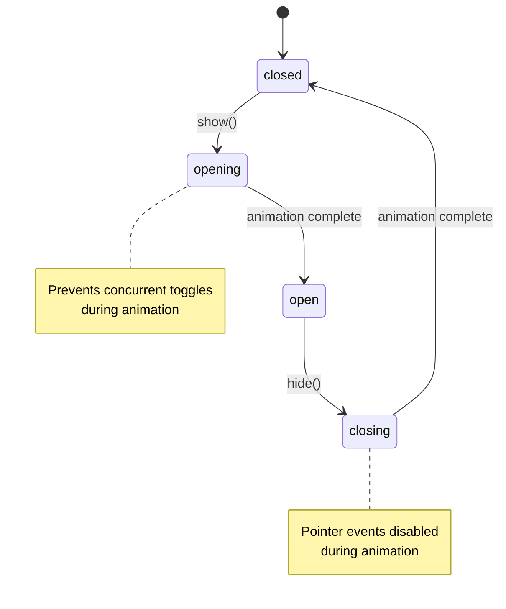

# Toggle Component - State Management Guide

**Component**: `Toggle.js`
**Status**: ✅ Complete with State-Based CSS
**Last Updated**: 2025-11-19

---

## Overview

The Toggle component manages show/hide functionality for dropdowns, modals, accordion panels, and other toggleable content. It uses state-based CSS with the `data-toggle-target` attribute to handle smooth animations between states.

## State Machine

### States

The Toggle component uses four states from `ExtendedStates`:

1. **`closed`** - Toggle target is fully closed and hidden
2. **`opening`** - Toggle target is animating from closed to open
3. **`open`** - Toggle target is fully open and visible
4. **closing`** - Toggle target is animating from open to closed

### State Transitions



### Transition Rules

- **From `closed`**: Can transition to `opening` when `show()` is called
- **From `opening`**: Automatically transitions to `open` after animation completes
- **From `open`**: Can transition to `closing` when `hide()` is called
- **From `closing`**: Automatically transitions to `closed` after animation completes
- **Invalid transitions** (e.g., `opening` → `opening`) are prevented by state checks

---

## Implementation

### HTML Structure

```html
<!-- Basic toggle -->
<button data-toggle data-toggle-target="#dropdown-menu">
  Toggle Menu
</button>
<div id="dropdown-menu" class="dropdown">
  <p>Dropdown content here</p>
</div>

<!-- Toggle with outside click capture -->
<button data-toggle
        data-toggle-target="#dropdown"
        data-toggle-capture="true">
  Dropdown
</button>
<div id="dropdown" class="dropdown">
  Menu items
</div>

<!-- Navigation menu that auto-closes on link clicks -->
<button data-toggle data-toggle-target="#navbar-navigation">
  Menu
</button>
<nav id="navbar-navigation">
  <a href="/page1">Page 1</a>
  <a href="/page2">Page 2</a>
  <a href="#section">Anchor link (won't close)</a>
</nav>

<!-- Manual toggle (no auto-close) -->
<button data-toggle data-toggle-target="#persistent">
  Persistent Toggle
</button>
<div id="persistent" data-toggle-manual="true">
  This won't auto-close
</div>
```

### State Attributes

The component sets the state on the **toggle target element** (not the trigger):

```html
<!-- Closed state -->
<div id="dropdown" data-toggle-target="closed">...</div>

<!-- Opening state -->
<div id="dropdown" data-toggle-target="opening">...</div>

<!-- Open state -->
<div id="dropdown" data-toggle-target="open">...</div>

<!-- Closing state -->
<div id="dropdown" data-toggle-target="closing">...</div>
```

### JavaScript API

```javascript
import Toggle from './components/Toggle.js';

// Initialize
const toggle = new Toggle();
toggle.mount(document.querySelector('[data-toggle]'));

// Programmatic control
toggle.show(triggerElement);   // Open toggle
toggle.hide(triggerElement);   // Close toggle
toggle.toggle(triggerElement); // Toggle state
toggle.isOpen(triggerElement); // Check if open

// Hide all non-manual toggles
toggle.hideAll();

// Get component status
const status = toggle.getStatus();
// Returns: { totalTriggers, openCount, captureCount, manualCount, defaults }
```

### Configuration

#### Data Attributes

- `data-toggle` - Marks element as toggle trigger (required)
- `data-toggle-target` - Selector for target element to toggle (required)
- `data-toggle-capture` - Enable outside click to close (default: `false`)
- `data-toggle-manual` - Prevent auto-closing behavior (default: `false`)
- `data-toggle-multiple` - Allow multiple toggles open simultaneously (default: `false`)
- `data-toggle-animate` - Enable animations (default: `true`)
- `data-toggle-close-navigation` - Auto-close when navigation links clicked (default: `true`)

#### Defaults

```javascript
Toggle.defaults = {
  openClass: 'open',              // Class added to target when open
  transitioningClass: 'transitioning',
  transitionDuration: 750,        // Animation duration in ms
  capture: false,                 // Outside click to close
  manual: false,                  // Prevent auto-closing
  multiple: false,                // Allow multiple toggles
  animateToggle: true,            // Enable animations
  closeOnEscape: true,            // Close on Escape key
  closeOnNavigation: true         // Close on navigation link clicks
};
```

---

## CSS State-Based Styling

### State Selectors

```scss
/* Toggle target states */
[data-toggle-target="closed"] {
  display: none;
  opacity: 0;
  max-height: 0;
  visibility: hidden;
}

[data-toggle-target="opening"] {
  display: block;
  opacity: 0;
  max-height: 0;
  visibility: visible;
  animation: slideDown var(--toggle-transition-duration) ease-in-out forwards;
  will-change: opacity, max-height, transform;
}

[data-toggle-target="open"] {
  display: block;
  opacity: 1;
  max-height: none;
  visibility: visible;
}

[data-toggle-target="closing"] {
  display: block;
  opacity: 1;
  visibility: visible;
  animation: slideUp var(--toggle-transition-duration) ease-in-out forwards;
  will-change: opacity, max-height, transform;
  pointer-events: none; /* Prevent interaction during close animation */
}
```

### Custom Animations

```scss
@keyframes slideDown {
  from {
    opacity: 0;
    max-height: 0;
    transform: translateY(-10px);
  }
  to {
    opacity: 1;
    max-height: 100vh;
    transform: translateY(0);
  }
}

@keyframes slideUp {
  from {
    opacity: 1;
    max-height: 100vh;
    transform: translateY(0);
  }
  to {
    opacity: 0;
    max-height: 0;
    transform: translateY(-10px);
  }
}
```

### CSS Variables

```css
:root {
  --toggle-transition-duration: 0.75s;
  --toggle-transition-easing: ease-in-out;
}
```

### Accessibility

The SCSS includes reduced motion support:

```scss
@media (prefers-reduced-motion: reduce) {
  [data-toggle-target] {
    transition: none;
    animation: none !important;
  }

  [data-toggle-target="opening"] {
    opacity: 1;
    max-height: none;
    transform: none;
  }

  [data-toggle-target="closing"] {
    opacity: 0;
    max-height: 0;
    transform: none;
  }
}
```

---

## Events

The Toggle component dispatches custom events:

```javascript
// Show event
element.addEventListener('toggle:show', (event) => {
  console.log('Toggle shown', event.detail.target);
});

// Hide event
element.addEventListener('toggle:hide', (event) => {
  console.log('Toggle hidden', event.detail.target);
});
```

Event detail includes:
- `target` - The toggle target element
- `trigger` - The trigger element

---

## Multi-Trigger Support

Multiple triggers can control the same target. The component synchronizes state across all triggers:

```html
<button data-toggle data-toggle-target="#menu">Open Menu</button>
<button data-toggle data-toggle-target="#menu">Also Opens Menu</button>

<div id="menu" data-toggle-target="closed">
  Menu content
</div>
```

All triggers targeting `#menu` will:
- Have synchronized `aria-expanded` attributes
- Receive the same internal state updates
- Trigger the same state transitions

---

## Features

### Outside Click Detection

When `data-toggle-capture="true"` is set, clicks outside both the trigger and target will close the toggle:

```html
<button data-toggle
        data-toggle-target="#dropdown"
        data-toggle-capture="true">
  Dropdown
</button>
<div id="dropdown">Content</div>
```

### Navigation Link Detection

By default, clicking navigation links inside a toggle target will close it. Links that **will** trigger closure:

- Internal page navigation: `<a href="/page">Page</a>`

Links that **won't** trigger closure:
- Anchor links: `<a href="#section">Section</a>`
- External links with target: `<a href="https://..." target="_blank">External</a>`
- mailto/tel links: `<a href="mailto:...">Email</a>`
- JavaScript links: `<a href="javascript:void(0)">Action</a>`
- Download links: `<a href="..." download>Download</a>`

Disable with `data-toggle-close-navigation="false"`.

### Escape Key Support

Press `Escape` to close any open non-manual toggle. Disable by setting `Toggle.defaults.closeOnEscape = false`.

### Manual Mode

Manual toggles won't auto-close on:
- Outside clicks
- Escape key
- Navigation link clicks

```html
<div id="persistent" data-toggle-manual="true">
  This won't auto-close
</div>
```

---

## Best Practices

### 1. Use Semantic HTML

```html
<!-- ✅ Good - button for interactive trigger -->
<button data-toggle data-toggle-target="#menu">Menu</button>

<!-- ❌ Avoid - div without proper semantics -->
<div data-toggle data-toggle-target="#menu">Menu</div>
```

### 2. Include ARIA Attributes

The component automatically manages `aria-expanded` and `aria-controls`, but you should provide initial values:

```html
<button data-toggle
        data-toggle-target="#menu"
        aria-expanded="false"
        aria-controls="menu">
  Menu
</button>
<div id="menu" role="menu">...</div>
```

### 3. Provide Visual Feedback

Style triggers based on their expanded state:

```scss
[data-toggle][aria-expanded="true"] {
  background-color: var(--color-active);
}
```

### 4. Animation Duration

Match JavaScript `transitionDuration` with CSS `--toggle-transition-duration`:

```javascript
Toggle.defaults.transitionDuration = 750; // ms
```

```css
:root {
  --toggle-transition-duration: 0.75s; /* Same duration */
}
```

### 5. Prevent Transition Interruption

The component prevents state changes during transitions by checking current state:

```javascript
if (currentState === ExtendedStates.OPENING ||
    currentState === ExtendedStates.OPEN) {
  return; // Prevent show() during opening/open
}
```

---

## Debugging

### Check Current State

```javascript
const target = document.getElementById('dropdown');
console.log('Current state:', target.getAttribute('data-toggle-target'));
```

### Monitor State Changes

```javascript
const observer = new MutationObserver((mutations) => {
  mutations.forEach((mutation) => {
    if (mutation.attributeName === 'data-toggle-target') {
      console.log('State changed:', mutation.target.getAttribute('data-toggle-target'));
    }
  });
});

observer.observe(target, { attributes: true });
```

### Component Status

```javascript
const status = toggle.getStatus();
console.log('Toggle status:', status);
// {
//   totalTriggers: 3,
//   openCount: 1,
//   captureCount: 2,
//   manualCount: 1,
//   defaults: { ... }
// }
```

---

## Performance Considerations

### 1. Will-Change Optimization

The CSS uses `will-change` only during transitions:

```scss
[data-toggle-target="opening"],
[data-toggle-target="closing"] {
  will-change: opacity, max-height, transform;
}
```

This optimizes animation performance without constantly consuming GPU resources.

### 2. Pointer Events During Closing

Interactions are disabled during closing animation:

```scss
[data-toggle-target="closing"] {
  pointer-events: none;
}
```

This prevents accidental interactions with content that's disappearing.

### 3. Event Cleanup

All event listeners are properly cleaned up when component is unmounted via AbortController pattern.

---

## Migration from Class-Based Approach

If you're upgrading from an older version:

### Before (Class-Based)
```html
<div class="dropdown">Content</div>
```

```javascript
// Manual class manipulation
target.classList.add('open');
target.classList.add('transitioning');
```

### After (State-Based)
```html
<div id="dropdown" data-toggle-target="closed">Content</div>
```

```javascript
// State-based approach
toggle.show(triggerElement);
// Sets data-toggle-target="opening" then "open"
```

### CSS Migration

```scss
/* Before */
.dropdown.open { display: block; }

/* After */
[data-toggle-target="open"] { display: block; }
```

---

## Summary

The Toggle component provides:

- ✅ **State machine** with 4 distinct states
- ✅ **State-based CSS** using data attributes
- ✅ **Smooth animations** with slideDown/slideUp
- ✅ **Multi-trigger support** with synchronized state
- ✅ **Outside click detection** (optional)
- ✅ **Navigation link auto-close** (optional)
- ✅ **Escape key support**
- ✅ **Manual mode** for persistent toggles
- ✅ **Accessibility** with ARIA attributes and reduced motion support
- ✅ **Performance optimization** with will-change management

For more examples, see the component source at `src/components/Toggle.js` and styles at `src/styles/framework/components/toggle.scss`.